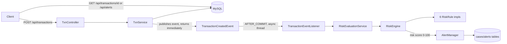

# Sentinel Fraud Detection — Backend Reference (for Frontend Integration)

This document describes everything the Spring Boot backend (`spring-Sentinel/`) exposes, so the
frontend can be built against it without reading the Java source. Base path for every endpoint below
is `http://localhost:8080` (default Spring Boot port, not overridden anywhere).

> A partial React frontend already exists in `sentinel-ui/`. Its `vite.config.js` proxies all `/api/*`
> calls to `http://localhost:8080`, so during dev you never need CORS or a hardcoded base URL — just
> call `fetch('/api/...')` from the frontend and run both servers side by side.

---

## 1. Running the backend

- Requires a local MySQL 8 instance (not the `compose.yaml` one — `spring.docker.compose.enabled=false`).
  DB name `sentinel`, user `root`, created automatically on first run (`createDatabaseIfNotExist=true`).
- `spring.jpa.hibernate.ddl-auto=update` — tables/columns are created/updated automatically on startup.
  **Caveat:** this does NOT retroactively widen existing native MySQL `ENUM` columns (e.g. `rule_type`,
  `severity`, `status`) if new enum values are added later — those need a manual `ALTER TABLE ... MODIFY
  COLUMN` if you ever add a new Java enum constant against an already-created DB.
- On first run with empty tables, `SeedDataService` auto-seeds:
  - 8 rows in `rules` (see §5 below) — the risk engine has working rules out of the box.
  - 5 demo customers, 10 demo accounts (`account_id` 1–10), 20 demo payees (`payee_id` 1–20) — ready-made
    IDs to use in Postman/frontend testing without creating your own first.
  - **This only happens once** — if a table already has rows, seeding for that table is skipped, even
    after code changes. New rule types added later must be inserted manually via `POST /api/rules`.
- Run with `mvnw spring-boot:run` (or the IDE Run config). Devtools is enabled — editing a source file and
  recompiling in another terminal auto-restarts the running app.
- The chatbot endpoint needs a `GROQ_API_KEY` environment variable to work (everything else works without it).

---

## 2. Architecture at a glance



**Critical integration detail:** transaction recording and rule evaluation are decoupled (async, event-driven).
`POST /api/transactions` returns **immediately** after saving the transaction row — the risk score, triggered
rules, alert, and case fields in the response will all be `null`/empty at that point, because evaluation hasn't
run yet. The frontend must **poll `GET /api/transactions/{id}`** (or `GET /api/alerts`) shortly after posting
to see the risk/alert outcome. In practice this resolves within milliseconds to a couple seconds, but it is
never guaranteed to be present synchronously in the POST response.

---

## 3. Data model (entities)

### Customer
| field | type | notes |
|---|---|---|
| customerId | Integer | PK, auto |
| firstName, lastName | String | required |
| email, phone, address | String | optional |
| createdAt | LocalDateTime | auto |

### Account
| field | type | notes |
|---|---|---|
| accountId | Integer | PK, auto |
| customer | Customer (FK) | required |
| accountNumber | String | required, unique |
| accountType | `AccountType` | CHECKING / SAVINGS / CREDIT |
| currency | String | default `USD` |
| status | `AccountStatus` | ACTIVE / CLOSED / FROZEN (default ACTIVE) |
| openedAt | LocalDateTime | auto |

### Payee
| field | type | notes |
|---|---|---|
| payeeId | Integer | PK, auto |
| payeeName | String | required |
| payeeIdentifier | String | required |

### Transaction
| field | type | notes |
|---|---|---|
| transactionId | Integer | PK, auto |
| account, payee | FK | required |
| amount | BigDecimal | required |
| currency | String | default `USD` |
| type | `TransactionType` | DEBIT / CREDIT |
| status | `TransactionStatus` | COMPLETED / PENDING / FAILED (default COMPLETED on create) |
| description, location, merchantCategory | String | optional |
| transactionTimestamp | LocalDateTime | when it happened (UTC) |
| createdAt | LocalDateTime | when the row was saved (UTC) |

### Rule (DB-driven monitoring rule config)
| field | type | notes |
|---|---|---|
| ruleId | Integer | PK, auto |
| ruleName | String | display name |
| ruleType | `RuleType` | see §5 |
| active | boolean | inactive rules are skipped entirely |
| weight | BigDecimal | contribution weight (0–1-ish) toward the final risk score, only applied if the rule triggers |
| thresholdValue | BigDecimal | meaning depends on `ruleType` — see §5 table |
| timeline | int | lookback window; unit depends on rule type (minutes for VELOCITY, days for others) |

### Alert (one row per triggering transaction)
| field | type | notes |
|---|---|---|
| alertId | Integer | PK, auto |
| transaction | FK | the transaction that triggered it |
| aCase (`case`) | FK, nullable | the Case it's grouped under |
| riskScore | BigDecimal | 0–100 |
| severity | `Severity` | HIGH / MID / LOW |
| status | `CaseStatus` | kept in sync with its Case's status (see §6) |
| createdAt, closedAt | LocalDateTime | |
| resolutionNotes | String | |

### Case (the investigation unit an analyst works)
| field | type | notes |
|---|---|---|
| caseId | Integer | PK, auto |
| account | FK | |
| version | long | optimistic-lock version (concurrent acknowledge/close protection) |
| riskScore | BigDecimal | highest score of any merged alert |
| severity | `Severity` | HIGH / MID / LOW |
| status | `CaseStatus` | OPEN / ACKNOWLEDGED / INVESTIGATING / CLOSED / DISMISSED |
| createdAt, closedAt, acknowledgedAt, lastAlertAt | LocalDateTime | |
| resolutionNotes | String | |

Multiple alerts on the same account within a **merge cooldown window** (default 60 min, configurable via
`/api/alert-settings`) get grouped into the same open Case instead of creating a new one each time (reduces
alert fatigue / duplicate cases for a burst of suspicious activity).

### AlertSettings (single row, id=1 — global config)
| field | notes |
|---|---|
| minScoreToCreateAlert | risk scores below this (default 50) never create an alert |
| lowSeverityMax | scores ≤ this (default 60) = LOW |
| mediumSeverityMax | scores ≤ this (default 80) = MID; above = HIGH |
| mergeCooldownMinutes | window to merge new alerts into an existing open case (default 60) |

### RuleEvaluation (audit trail — one row per active rule per transaction, always logged)
Fields: `transaction` (FK), `rule` (FK), `riskScore` (0–1 normalized), `triggered` (boolean), `reason` (text),
`evaluatedAt`. Logged for **every** active rule, not just the ones that fired — this is the full audit trail
of rule evaluations. Not directly exposed via a dedicated REST endpoint currently, but backs the
`triggeredRules`/`evidence` fields on `GET /api/transactions/{id}`.

---

## 4. Enums reference

| Enum | Values |
|---|---|
| `TransactionType` | `DEBIT`, `CREDIT` |
| `TransactionStatus` | `COMPLETED`, `PENDING`, `FAILED` |
| `TransactionSource` | `API`, `SIMULATOR` (internal — marks how a transaction was created) |
| `AccountType` | `CHECKING`, `SAVINGS`, `CREDIT` |
| `AccountStatus` | `ACTIVE`, `CLOSED`, `FROZEN` |
| `RuleType` | `AMOUNT_ANOMALY`, `AMOUNT_THRESHOLD`, `VELOCITY`, `NEW_PAYEE`, `TIME_ANOMALY`, `DEVICE_CHANGE` (unused, no rule bound), `LOCATION_CHANGE`, `SPENDING_PATTERN` |
| `Severity` | `HIGH`, `MID`, `LOW` |
| `CaseStatus` | `OPEN`, `ACKNOWLEDGED`, `INVESTIGATING`, `CLOSED`, `DISMISSED` (used by both `alerts.status` and `cases.status`) |
| `QueueStatus` | `PENDING`, `PROCESSING`, `EVALUATED`, `FAILED` (internal evaluation audit trail, not exposed via API) |

All enums are serialized/deserialized as their **string name** in JSON (e.g. `"type": "DEBIT"`), not ordinal numbers.

---

## 5. Rule engine / rule types

Rules are DB-driven (the `rules` table) and fully editable via `/api/rules` CRUD — no redeploy needed. The
`RiskEngine` evaluates every **active** rule against every transaction, computes a weighted average of the
rules that triggered → a final **risk score (0–100)**, then hands that to `AlertManager` which decides
whether to create/merge an Alert+Case.

| ruleType | What it does | `thresholdValue` means | `timeline` means |
|---|---|---|---|
| `AMOUNT_ANOMALY` | Statistical (z-score) deviation from the account's own historical mean amount | z-score threshold (e.g. `3.00`) | lookback window in days (default 90) |
| `AMOUNT_THRESHOLD` | Flat dollar limit — single transaction over this amount triggers, regardless of account history | dollar amount (e.g. `10000.00`) | n/a (informational) |
| `VELOCITY` | N+ transactions from the same account within a time window | transaction count threshold (e.g. `5.00`) | lookback window **in minutes** (e.g. `10`) |
| `NEW_PAYEE` | First-ever transaction from this account to this payee | normalized score (0–1) contributed when triggered | lookback window in days |
| `TIME_ANOMALY` | Transaction at an unusual time of day for this account | normalized score (0–1) | lookback window in days |
| `LOCATION_CHANGE` | Transaction location differs from the account's usual pattern | normalized score (0–1) | lookback window in days |
| `SPENDING_PATTERN` | Deviation from the account's usual spending category/pattern | normalized score (0–1) | lookback window in days |
| `DEVICE_CHANGE` | Schema placeholder only — **no Java rule implementation is bound to it**, seeded inactive, never evaluated | — | — |

**Known gap (not yet implemented):** a "Daily Limit" rule (cumulative daily transaction total per account
exceeding a limit, e.g. >$50,000/day) does not exist yet as a rule type.

A single rule failing during evaluation (e.g. unexpected null data) never crashes the whole evaluation — it's
caught, logged, and contributes 0 to the score (graceful degradation).

---

## 6. Alert / Case lifecycle

```
OPEN ──────────► ACKNOWLEDGED ──────────► INVESTIGATING ──────────► CLOSED
                       │                        │
                       └───────► DISMISSED ◄─────┘
```

- `CLOSED` and `DISMISSED` are **terminal** — no further transitions allowed from either.
- Illegal transitions (e.g. closing an `OPEN` case without acknowledging first, or acting on an already-`CLOSED`
  case) return **HTTP 409 Conflict** with body `{"error": "..."}`.
- An `Alert`'s `status` always mirrors its parent `Case`'s status (kept in sync on every lifecycle action) —
  you don't need to update alerts and cases separately.
- `acknowledgedAt` is set the first time a case is acknowledged (used for the "average time to acknowledge" stat).
- `closedAt` is set when moving to `CLOSED` or `DISMISSED`.

---

## 7. REST API reference

All request/response bodies are JSON. All timestamps are ISO-8601 `LocalDateTime` strings (no timezone
suffix — treat as UTC). All IDs are integers.

### Transactions — `/api/transactions`

| Method | Path | Body | Response |
|---|---|---|---|
| POST | `/api/transactions` | `TransactionRequest` (below) | `201` + `TransactionResponse` (risk/alert fields will be empty — see §2) |
| GET | `/api/transactions` | query params (below) | `200` + Spring `Page<TransactionResponse>` |
| GET | `/api/transactions/{id}` | — | `200` + `TransactionResponse` (risk/alert fields populated once async eval has run), `404`-style error if not found (see §8 error caveat) |

**`TransactionRequest` body:**
```json
{
  "accountId": 1,
  "payeeId": 1,
  "amount": 250.00,
  "currency": "USD",
  "type": "DEBIT",
  "description": "optional",
  "location": "optional",
  "merchantCategory": "optional"
}
```

**`GET /api/transactions` query params (all optional, combined with AND):**
`accountId`, `payeeId`, `status` (`TransactionStatus`), `type` (`TransactionType`), `minAmount`, `maxAmount`,
`from`, `to` (ISO datetime), `search` (matches description/id), plus standard Spring `Pageable` params:
`page`, `size` (default 50), `sort` (default `transactionTimestamp,desc`).

**`TransactionResponse` shape:**
```json
{
  "transactionId": 101,
  "accountId": 1,
  "payeeId": 1,
  "amount": 250.00,
  "currency": "USD",
  "type": "DEBIT",
  "transactionTimestamp": "2026-08-02T10:15:30",
  "status": "COMPLETED",
  "description": "...",
  "createdAt": "2026-08-02T10:15:30",
  "location": "...",
  "merchantCategory": "...",
  "riskScore": 72,
  "triggeredRules": ["VELOCITY", "NEW_PAYEE"],
  "evidence": ["6 transactions detected within the last 10 minute(s) (threshold=5)", "First transaction to payee 12"],
  "alertId": 55,
  "alertSeverity": "MID",
  "alertStatus": "OPEN",
  "caseId": 30,
  "caseSeverity": "MID",
  "caseStatus": "OPEN"
}
```
`riskScore`/`triggeredRules`/`evidence` are `null`/empty and `alertId`/`caseId` etc. are `null` if the
transaction didn't trigger anything (or hasn't been evaluated yet).

### Alerts — `/api/alerts` (read-only)

| Method | Path | Response |
|---|---|---|
| GET | `/api/alerts` | `200` + `Alert[]` (full entity, includes nested `transaction` and `case`) |
| GET | `/api/alerts/{id}` | `200` + `Alert`, or `404` |

### Cases — `/api/cases` (this is where lifecycle actions live)

| Method | Path | Body | Response |
|---|---|---|---|
| GET | `/api/cases` | — | `200` + `Case[]` |
| GET | `/api/cases/{id}` | — | `200` + `Case`, or `404` |
| PATCH | `/api/cases/{id}/acknowledge` | — | `200` + updated `Case`, or `409` if illegal transition |
| PATCH | `/api/cases/{id}/investigate` | — | `200` + updated `Case`, or `409` |
| PATCH | `/api/cases/{id}/close` | `{"resolutionNotes": "..."}` (optional) | `200` + updated `Case`, or `409` |
| PATCH | `/api/cases/{id}/dismiss` | `{"resolutionNotes": "..."}` (optional) | `200` + updated `Case`, or `409` |
| GET | `/api/cases/stats` | — | `200` + `CaseStatsResponse` (below) |

**`CaseStatsResponse`:**
```json
{
  "countByStatus": { "OPEN": 12, "ACKNOWLEDGED": 3, "INVESTIGATING": 1, "CLOSED": 40, "DISMISSED": 5 },
  "avgMinutesToAcknowledge": 14.2,
  "avgMinutesToClose": 132.7,
  "totalCases": 61
}
```
`avgMinutesToAcknowledge`/`avgMinutesToClose` are `null` if no cases have reached that stage yet.

**409 error body:** `{"error": "Cannot transition from CLOSED to ACKNOWLEDGED"}` (message format may vary).

### Rules — `/api/rules` (full CRUD, editable at runtime)

| Method | Path | Body | Response |
|---|---|---|---|
| GET | `/api/rules` | — | `200` + `Rule[]` |
| GET | `/api/rules/{id}` | — | `200` + `Rule`, or `404` |
| POST | `/api/rules` | `RuleRequest` | `201` + created `Rule` |
| PATCH | `/api/rules/{id}` | `RuleRequest` (partial — only send fields to change) | `200` + updated `Rule`, or `404` |
| DELETE | `/api/rules/{id}` | — | `204`, or `404` |

**`RuleRequest` body (all fields optional on PATCH, required-ish on POST):**
```json
{
  "ruleName": "Amount Threshold",
  "ruleType": "AMOUNT_THRESHOLD",
  "active": true,
  "weight": 1.000,
  "thresholdValue": 10000.00,
  "timeline": 30
}
```
Rule changes take effect on the very next transaction (cache is evicted on every mutation).

### Alert Settings — `/api/alert-settings`

| Method | Path | Body | Response |
|---|---|---|---|
| GET | `/api/alert-settings` | — | `200` + `AlertSettings` (returns seeded defaults if none exist yet, never 404) |
| PUT | `/api/alert-settings` | `AlertSettings` (full object) | `200` + updated `AlertSettings` |

### Accounts / Customers / Payees — simple CRUD (create + list + get-by-id only, no update/delete)

| Resource | POST body | GET list | GET by id |
|---|---|---|---|
| `/api/customers` | `{firstName, lastName, email, phone, address}` | `Customer[]` | `Customer` |
| `/api/accounts` | `{customerId, accountNumber, accountType, currency}` | `Account[]` | `Account` |
| `/api/payees` | `{payeeName, payeeIdentifier}` | `Payee[]` | `Payee` |

Demo data already seeded: `customer_id` 1–5, `account_id` 1–10, `payee_id` 1–20.

### Simulator — `/api/simulator` (test-data generator, not needed for real frontend use but useful for demos)

| Method | Path | Response |
|---|---|---|
| POST | `/api/simulator/start` | `{"running": true, "message": "..."}` — starts continuous random transaction generation |
| POST | `/api/simulator/stop` | `{"running": false, "message": "..."}` |
| GET | `/api/simulator/status` | `{"running": true/false}` |
| POST | `/api/simulator/trigger/{scenario}` | `scenario` = `velocity` \| `high-value` \| `new-payee` — fires that specific scenario once immediately |

### Chatbot — `/api/chatbot/ask`

| Method | Path | Body | Response |
|---|---|---|---|
| POST | `/api/chatbot/ask` | `{"question": "..."}` | `200` + `{"answer": "..."}`, or `400` if question is blank |

Answers are grounded only in the `rules` table + local docs (no open web search). Requires `GROQ_API_KEY`
env var on the backend to function.

---

## 8. Important integration caveats

1. **Async evaluation delay** (see §2) — never assume `POST /api/transactions` returns risk/alert data.
   Poll `GET /api/transactions/{id}` or `GET /api/alerts` afterward. In UI terms: show the transaction as
   "recorded" immediately, then update its risk badge/alert indicator once a follow-up fetch shows it.
2. **No global error-response format.** Most "not found" conditions (e.g. posting a transaction with a
   non-existent `accountId`/`payeeId`) throw a plain `RuntimeException`, which Spring turns into a generic
   `500` error body, **not** a clean `404`/`400`. The only endpoint with structured error handling is the
   Case lifecycle's `409 Conflict` for illegal transitions. Frontend should treat any non-2xx response as a
   generic failure and show the raw message rather than relying on specific error shapes elsewhere.
3. **No authentication** — every endpoint is open, no login/session/token needed (matches the assignment's
   "single operator, no auth" requirement).
4. **No WebSocket/SSE** — the frontend must poll for updates (e.g. re-fetch `/api/cases` or `/api/alerts`
   periodically) rather than expecting a push notification for new alerts.
5. **CORS** is not configured on the backend at all — it relies entirely on the Vite dev proxy (see top of
   this doc) to avoid cross-origin issues. If the frontend is ever served from a different origin without a
   proxy (e.g. a separate production deployment), CORS will need to be added to the backend.
6. **Pagination** on `GET /api/transactions` uses Spring's standard `Page` wrapper — `content` is the array
   you want to render; `totalElements`/`totalPages`/`number`/`size`/`last` drive pagination controls.
7. **Enums are case-sensitive exact strings** in both directions — e.g. send `"type": "DEBIT"`, not `"debit"`.
