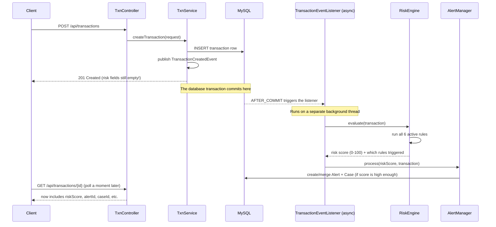
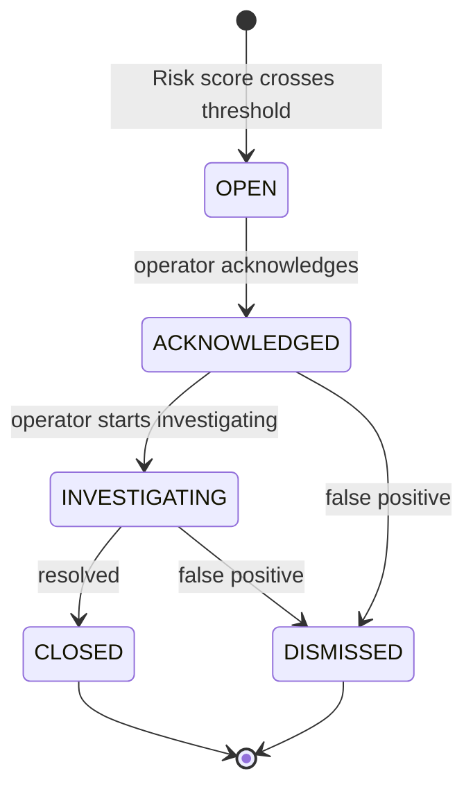

# Sentinel — Transaction Monitoring & Fraud Alert System

## Full Project Documentation (Final)

This document explains **everything** about the Sentinel project: what it does, how every
piece works, why it was built that way, and how all the pieces fit together. It's written in
plain, simple language so anyone (including someone who never saw the code) can understand the
whole system end to end.

> This is the **final** documentation for the project. If you only read one file to understand
> Sentinel, read this one.

---

## Table of Contents

1. [What is Sentinel?](#1-what-is-sentinel)
2. [The Big Picture (Architecture)](#2-the-big-picture-architecture)
3. [Technology Stack](#3-technology-stack)
4. [Project Folder Structure](#4-project-folder-structure)
5. [The Database (Data Model)](#5-the-database-data-model)
6. [How a Transaction Flows Through the System](#6-how-a-transaction-flows-through-the-system)
7. [The Rule Engine — How Fraud is Detected](#7-the-rule-engine--how-fraud-is-detected)
8. [The Alert Manager — Turning Risk Scores into Alerts](#8-the-alert-manager--turning-risk-scores-into-alerts)
9. [Alert / Case Lifecycle](#9-alert--case-lifecycle)
10. [Caching](#10-caching)
11. [Concurrency & Locking (Why Two Alerts Don't Collide)](#11-concurrency--locking-why-two-alerts-dont-collide)
12. [Error Handling](#12-error-handling)
13. [The Transaction Simulator (Fake Data Generator)](#13-the-transaction-simulator-fake-data-generator)
14. [The AI Chatbot](#14-the-ai-chatbot)
15. [The Network Analysis Feature (Python)](#15-the-network-analysis-feature-python)
16. [The Frontend (React UI)](#16-the-frontend-react-ui)
17. [Full REST API Reference](#17-full-rest-api-reference)
18. [Configuration Reference](#18-configuration-reference)
19. [How to Run the Whole Project](#19-how-to-run-the-whole-project)
20. [Security Notes](#21-security-notes)
21. [What's NOT Implemented / Known Gaps](#20-whats-not-implemented--known-gaps)
22. [Glossary (Plain-English Definitions)](#22-glossary-plain-english-definitions)

---

## 1. What is Sentinel?

Sentinel is a **transaction monitoring and fraud alert system**. Think of it like a security
guard that watches every single bank transaction as it happens, and decides:

- "This looks normal, ignore it."
- "This looks suspicious, raise an alert so a human can look at it."

It was built as a training project based on a spec called *"Transaction Monitoring & Alerts
Dashboard"* (see [transaction_monitoring.md](transaction_monitoring.md) for the original
assignment brief). The system does more than the minimum asked for — it also includes an AI
chatbot and a separate "network analysis" engine that looks for suspicious patterns *between*
accounts (not just within one account).

The project has three main parts:

| Part | Language/Tech | What it does |
|---|---|---|
| **Backend API** (`spring-Sentinel/`) | Java + Spring Boot | Stores transactions, runs the rule engine, manages alerts/cases, exposes a REST API |
| **Frontend UI** (`sentinel-ui/`) | React + Vite | Dashboard for viewing transactions, alerts, cases, rules, and network-risk data |
| **Network Analysis** (`network-analysis/`) | Python | A periodic batch job that looks at the whole graph of accounts and payees to spot suspicious *relationships*, separate from the real-time per-transaction checks |

---

## 2. The Big Picture (Architecture)

```mermaid
flowchart TB
    subgraph Frontend["sentinel-ui (React)"]
        UI1[Transactions Page]
        UI2[Network Insights Page]
    end

    subgraph Backend["spring-Sentinel (Spring Boot)"]
        API[REST Controllers]
        TxnSvc[TransactionService]
        Event[TransactionCreatedEvent]
        Listener[TransactionEventListener - async]
        RiskEval[RiskEvaluationService]
        Engine[RiskEngine + 6 Rule impls]
        AlertMgr[AlertManager]
        Sim[TransactionSimulator]
        Chat[ChatbotService]
        Cache[(Caffeine Cache)]
    end

    subgraph DB["MySQL Database"]
        Tables[(transactions, rules, alerts,\ncases, accounts, customers,\npayees, network_* tables)]
    end

    subgraph NetworkJob["network-analysis (Python)"]
        Graph[graph_builder.py]
        Algo[algorithms.py]
        Score[scoring.py]
    end

    UI1 -->|HTTP /api/transactions, /api/alerts, /api/cases, /api/rules| API
    UI2 -->|HTTP /api/network/*| API
    API --> TxnSvc
    TxnSvc -->|save| Tables
    TxnSvc -->|publish, returns instantly| Event
    Event -->|AFTER_COMMIT, on a background thread| Listener
    Listener --> RiskEval --> Engine
    Engine <-->|reads active rules, historical data| Tables
    Engine -->|risk score 0-100| AlertMgr
    AlertMgr -->|creates/merges| Tables
    Sim -->|generates fake transactions| TxnSvc
    Chat -->|reads current rules + local docs| Tables
    API -->|launches subprocess for "Run Analysis Now"| NetworkJob
    NetworkJob -->|reads transactions/cases,\nwrites network_* tables| Tables
    Cache -.->|speeds up repeated reads| Engine
```

**The single most important design decision in this whole project:** recording a transaction
and *evaluating* that transaction for fraud are two separate steps that happen at two separate
times. Saving a transaction is instant. Checking it against the rules happens a split second
later, in the background, without making the person who submitted the transaction wait. This is
called an **event-driven / asynchronous architecture**, and it's explained fully in
[section 6](#6-how-a-transaction-flows-through-the-system).

---

## 3. Technology Stack

### Backend (`spring-Sentinel/`)
- **Java 21**, **Spring Boot 4.1.0** (packaged as a `.war`, but runs standalone via `mvnw spring-boot:run`)
- **Spring Data JPA** + **Hibernate** — talks to the database without writing raw SQL for most operations
- **MySQL 8** — the database (via `mysql-connector-j` driver)
- **HikariCP** — the database connection pool (comes bundled with Spring Boot)
- **Caffeine** — an in-memory cache (via `spring-boot-starter-cache`) used to avoid re-reading
  slow-changing data (like the active rule list) on every single transaction
- **springboot4-dotenv** — loads secrets (like API keys) from a local `.env` file instead of
  hardcoding them
- **Spring DevTools** — auto-restarts the app when you recompile code, so you don't have to
  manually stop/start it while developing
- No Lombok in day-to-day use for the risk-sensitive classes (see gotcha notes below) — getters/
  setters/constructors are written out by hand in some places for reliability across JDK versions

### Frontend (`sentinel-ui/`)
- **React 19** + **Vite 8** (fast dev server + build tool)
- **oxlint** — a fast linter for catching code issues
- Plain CSS (no CSS framework like Bootstrap/Tailwind) — hand-written `.css` files per component
- No routing library — page switching is done with a simple `useState` tab switcher in `App.jsx`
- No charting/graph library — the network graph view is a small hand-built SVG component

### Network Analysis (`network-analysis/`)
- **Python 3.13**, run inside its own virtual environment (`.venv/`)
- **NetworkX** — graph algorithms (building the graph, running PageRank)
- **python-louvain** (`community` package) — community detection (finding clusters of related accounts)
- **pandas** — data wrangling
- **SQLAlchemy + PyMySQL** — talks to the same MySQL database as the backend
- **scipy** — required internally by NetworkX's PageRank implementation
- **python-dotenv** — loads DB credentials from a local `.env` file

---

## 4. Project Folder Structure

```
Sentinels/
├── transaction_monitoring.md      ← the original project brief/assignment
├── BACKEND_API_REFERENCE.md       ← API reference written specifically for frontend devs
├── PROJECT_DOCUMENTATION.md       ← this file (the full explanation of everything)
├── DataBase/, db/                 ← raw SQL schema dump files
├── notes/                         ← design notes written during planning
│   ├── RiskLogic.md               ← plain-English explanation of every risk signal
│   ├── Individual-Rules.md        ← per-rule detail notes
│   ├── Database.md / DatabaseDraft.md ← data model planning notes
│   └── RiskLog.md                 ← risk engine planning log
├── optimization-notes/            ← performance tuning notes
├── spring-Sentinel/                ← the backend (Java/Spring Boot)
│   └── src/main/java/com/example/
│       ├── controller/            ← REST API endpoints (one file per resource)
│       ├── service/                ← business logic (transactions, chatbot, simulator, seeding)
│       ├── entity/                 ← database tables, one Java class per table
│       ├── dto/                    ← request/response JSON shapes (what the API actually sends/receives)
│       ├── enums/                   ← fixed sets of values (TransactionType, CaseStatus, etc.)
│       ├── repository/              ← database query interfaces (Spring Data JPA)
│       ├── event/                    ← the "transaction created" event class + listener
│       ├── exception/                 ← custom errors + the global error handler
│       ├── config/                    ← async thread pool config + cache config
│       └── riskengine/                ← the fraud-detection brain (see below)
│           ├── engine/                 ← RiskEngine.java — orchestrates rule evaluation
│           ├── rules/                  ← one Java class per rule type (Strategy pattern)
│           ├── alert/                  ← AlertManager.java — decides alert/case creation
│           ├── model/                  ← internal data shapes used only inside the risk engine
│           ├── service/                ← HistoricalProfileService — computes account history stats
│           ├── config/                 ← AlertConfig — severity band thresholds
│           └── repository/             ← risk-engine-specific queries
├── sentinel-ui/                    ← the frontend (React)
│   └── src/
│       ├── App.jsx                  ← top-level tab switcher (Transactions / Network Insights)
│       ├── api/                      ← fetch() wrapper functions per backend resource
│       ├── components/transactions/  ← transaction table, filter bar, expanded row detail
│       ├── components/network/       ← network score table, summary cards, graph view
│       └── utils/                    ← small shared helper functions
└── network-analysis/                ← the Python batch job
    ├── run_analysis.py               ← the script that runs one full analysis pass
    ├── graph_builder.py               ← builds the account↔payee graph
    ├── algorithms.py                   ← the actual graph-science computations
    ├── scoring.py                      ← combines raw signals into one 0-100 score
    ├── db.py                            ← database access layer
    ├── config.py                         ← settings (weights, thresholds, DB connection)
    ├── scheduler.py                       ← optional loop that runs the job on a timer
    └── seed_network_data.py               ← one-off script to generate test data with fake "communities"
```

---

## 5. The Database (Data Model)

Sentinel uses **one MySQL database** called `sentinel`. Spring Boot automatically creates/updates
all the tables for you on startup (`spring.jpa.hibernate.ddl-auto=update`) — nobody has to write
manual `CREATE TABLE` migrations for the core tables.

### Core tables

**`customers`** — the people who own bank accounts.
`customer_id`, `first_name`, `last_name`, `email`, `phone`, `address`, `created_at`.

**`accounts`** — a customer's bank account.
`account_id`, `customer_id` (FK), `account_number` (unique), `account_type`
(`CHECKING`/`SAVINGS`/`CREDIT`), `currency` (default `USD`), `status`
(`ACTIVE`/`CLOSED`/`FROZEN`), `opened_at`.

**`payees`** — the people/companies an account sends money to or receives money from.
`payee_id`, `payee_name`, `payee_identifier`.

**`transactions`** — every single money movement recorded in the system. This is the core table
everything else revolves around.
`transaction_id`, `account_id` (FK), `payee_id` (FK), `amount`, `currency`, `type`
(`DEBIT`/`CREDIT`), `status` (`COMPLETED`/`PENDING`/`FAILED`), `description`, `location`,
`merchant_category`, `transaction_timestamp` (when it actually happened), `created_at` (when the
row was saved to the DB). Note: a `TransactionSource` value (`API`/`SIMULATOR`) is passed internally
when a transaction is created, but it is **not** persisted as a database column — it's only used
for a server-side log line, so there's no way to tell simulator-generated rows apart from real ones
by querying the database.

**`rules`** — the configurable fraud-detection rules (explained fully in
[section 7](#7-the-rule-engine--how-fraud-is-detected)).
`rule_id`, `rule_name`, `rule_type`, `active` (true/false), `weight` (how much this rule counts
toward the final score), `threshold_value` (meaning depends on rule type), `timeline` (lookback
window — minutes or days depending on rule type).

**`rule_evaluations`** — an **audit trail**. Every time a transaction is checked against a rule,
one row is logged here — even if the rule *didn't* trigger. This means you can always answer "why
wasn't this flagged?" for any past transaction, not just "why was it flagged?".
`transaction_id`, `rule_id`, `risk_score` (0–1), `triggered` (true/false), `reason` (plain-English
explanation), `evaluated_at`.

**`alerts`** — one row is created every time a transaction's total risk score crosses the alert
threshold. An alert always belongs to exactly one case.
`alert_id`, `transaction_id` (FK), `case_id` (FK), `risk_score` (0–100), `severity`
(`HIGH`/`MID`/`LOW`), `status` (mirrors its case's status), `created_at`, `closed_at`,
`resolution_notes`.

**`cases`** — the actual thing an investigator/operator works on. Multiple alerts on the same
account within a short time window get grouped ("merged") into one case instead of flooding the
operator with duplicates.
`case_id`, `account_id` (FK), `version` (used to safely handle two people updating the same case
at once), `risk_score` (highest score of any merged alert), `severity`, `status`
(`OPEN`/`ACKNOWLEDGED`/`INVESTIGATING`/`CLOSED`/`DISMISSED`), `created_at`, `acknowledged_at`,
`closed_at`, `last_alert_at`, `resolution_notes`, `resolution_reason_code`.

**`alert_settings`** — a single global-config row (id=1) that controls how sensitive the whole
system is: `min_score_to_create_alert` (default 50 — scores below this never create an alert),
`low_severity_max` (default 60), `medium_severity_max` (default 80 — anything above this is
`HIGH`), `merge_cooldown_minutes` (default 60 — how long a "case" stays open to merging).

### Network-analysis tables (written by the Python job, read by the Spring API)

**`network_runs`** — one row per time the network-analysis job runs.
`run_id`, `started_at`, `completed_at`, `status` (`COMPLETED`/`FAILED`), `trigger_type`
(`MANUAL`/`SCHEDULED`), `lookback_days`, `algorithm_version`, `accounts_analyzed`,
`accounts_flagged`, `error_message`.

**`account_network_scores`** — one row per account **per run** (append-only history, never
overwritten, so you can see how an account's network risk changed over time).
`run_id`, `account_id`, `network_risk_score` (0–100), `page_rank_percentile`, `shared_payee_count`,
`community_id`, `community_size`, `growth_score`, `fraud_exposure_score`, `evidence_json`,
`network_reason` (plain-English explanation), `computed_at`.

**`network_run_requests`** — a queue table for the *scheduled* (non-manual) version of the
network job. Not used by the manual "Run Analysis Now" button anymore (that runs the Python
script directly and waits — see [section 15](#15-the-network-analysis-feature-python)).

### Enums (fixed value lists) used across these tables

| Enum | Allowed values |
|---|---|
| `TransactionType` | `DEBIT`, `CREDIT` |
| `TransactionStatus` | `COMPLETED`, `PENDING`, `FAILED` |
| `TransactionSource` | `API`, `SIMULATOR` |
| `AccountType` | `CHECKING`, `SAVINGS`, `CREDIT` |
| `AccountStatus` | `ACTIVE`, `CLOSED`, `FROZEN` |
| `RuleType` | `AMOUNT_ANOMALY`, `AMOUNT_THRESHOLD`, `VELOCITY`, `NEW_PAYEE`, `TIME_ANOMALY`, `DEVICE_CHANGE`, `LOCATION_CHANGE`, `SPENDING_PATTERN` |
| `Severity` | `HIGH`, `MID`, `LOW` |
| `CaseStatus` | `OPEN`, `ACKNOWLEDGED`, `INVESTIGATING`, `CLOSED`, `DISMISSED` |
| `ResolutionReasonCode` | Structured reason recorded when a case is closed/dismissed (e.g. `CONFIRMED_FRAUD`) — this is what feeds the Python job's fraud-detection signal |
| `NetworkRunStatus` | `PENDING`, `RUNNING`, `COMPLETED`, `FAILED` |
| `NetworkRunTrigger` | `MANUAL`, `SCHEDULED` |

All enums are sent/received in the API as their plain string name (e.g. `"DEBIT"`), not as a
number — this makes the JSON self-explanatory instead of needing a lookup table.

### Sample/demo data

On first run against an empty database, `SeedDataService` automatically creates:
- 8 starter rules (see [section 7](#7-the-rule-engine--how-fraud-is-detected))
- 5 demo customers, 10 demo accounts (IDs 1–10), 20 demo payees (IDs 1–20)

This only happens **once** — if the tables already have rows (even from a previous run), seeding
is skipped entirely, so editing the seed values in code later won't retroactively fix already-
created data; you'd need to update the existing rows directly.

---

## 6. How a Transaction Flows Through the System

This is the most important flow to understand in the whole project.



**Why do it this way instead of checking the rules immediately?**

The project brief specifically raises this question: *"Should rule evaluation happen
synchronously when a transaction is recorded?"* Sentinel's answer is **no** — for two reasons:

1. **Speed.** Recording a transaction should be instant, no matter how complicated or slow the
   fraud checks get later. Imagine 1,000 transactions per second — if each one had to wait for 6
   rules to run (each possibly querying transaction history), the whole system would slow down.
2. **Separation of concerns.** Recording money movement and deciding "is this suspicious?" are two
   different jobs. Keeping them separate means you can add more/slower/smarter rules later
   without ever making the "record a transaction" endpoint slower.

**The trade-off (and it's an important one for the frontend):** because evaluation happens
*after* the API already replied "success," the transaction you get back from `POST
/api/transactions` will have `riskScore`, `triggeredRules`, `alertId`, and `caseId` all empty/
null. The real values only appear a moment later (usually milliseconds, sometimes a couple of
seconds) when you re-fetch that same transaction via `GET /api/transactions/{id}` or check `GET
/api/alerts`. The frontend is built to handle this — it shows the transaction as "recorded" right
away, and updates its risk badge once a follow-up fetch shows a result.

**Technically, how does "after the database commit, but async" work?** Spring's
`@TransactionalEventListener(phase = AFTER_COMMIT)` is used — this guarantees the listener only
fires once the transaction row is *actually* safely saved in the database (not before), and
`@Async` (backed by a dedicated thread pool configured in `AsyncConfig.java`) makes sure it runs
on a separate background thread instead of blocking the original request.

---

## 7. The Rule Engine — How Fraud is Detected

The rule engine is the "brain" that decides whether a transaction is suspicious. It's built using
the **Strategy design pattern**: every rule type is its own small, independent Java class that all
share one common interface (`RiskRule`). This means adding a brand-new rule type later never
requires touching the existing rules' code — you just write one new class and register it.

### How rules are stored

Rules live in the `rules` **database table**, not hardcoded in Java. This means an operator can
add, edit, activate/deactivate, or delete a rule through the API (`/api/rules`) **without
redeploying the application**. Every rule row has:

- `ruleType` — which kind of check this is (see table below)
- `active` — inactive rules are skipped completely
- `weight` — how much this rule counts toward the final combined score, *if it triggers*
- `thresholdValue` — the number that decides "does this count as suspicious?" (meaning depends on rule type)
- `timeline` — the lookback time window (minutes for velocity checks, days for everything else)

### The 8 rule types

| Rule Type | Plain-English explanation | What `thresholdValue` means | What `timeline` means |
|---|---|---|---|
| **Amount Anomaly** | "Is this transaction unusually large *for this specific account*, compared to its own history?" Uses a statistical measure called a **z-score** (how many standard deviations away from the account's normal average this amount is). | z-score cutoff (e.g. `3.00` = 3 standard deviations) | lookback window in days (default 90) |
| **Amount Threshold** | "Is this a flat-out large transaction, regardless of account history?" A simple fixed-dollar check, e.g. anything over $10,000. This directly matches the assignment's *"Amount Threshold Rule"* requirement. | dollar amount (e.g. `10000.00`) | not used |
| **Velocity Check** | "Is this account suddenly making lots of transactions very quickly?" Counts how many transactions happened in a short recent window. | number of transactions (e.g. `5`) | window **in minutes** (e.g. `10`) |
| **New Payee** | "Has this account ever sent money to this payee before?" If never, that's inherently a bit riskier (new relationships are a common fraud pattern, e.g. a hijacked account suddenly paying a brand-new "payee"). | a normalized score contributed when it fires | lookback window in days |
| **Time Anomaly** | "Is this happening at an unusual time of day for this account?" (e.g. an account that only ever transacts 9am–5pm suddenly has a 3am transaction). | normalized score (0–1) | lookback window in days |
| **Location Change** | "Does the transaction location look different from where this account usually transacts?" | normalized score (0–1) | lookback window in days |
| **Spending Pattern** | "Does this transaction's category/pattern look different from the account's normal spending habits?" | normalized score (0–1) | lookback window in days |
| **Device Change** | A placeholder rule type that exists in the database/enum but has **no actual Java logic wired up to it** — seeded as inactive and never evaluated. Reserved for future use if device-fingerprint data becomes available. | — | — |

### How the final score is calculated

For every incoming transaction, the `RiskEngine`:

1. Loads all currently **active** rules (cached for 60 seconds so this doesn't hit the database
   on every single transaction — see [section 10](#10-caching)).
2. Runs **every** active rule against the transaction (each rule gets the transaction, the
   account's historical profile, and its own config).
3. Each rule replies with: did it trigger (yes/no), a raw score (0–1), and a plain-English reason
   string (e.g. `"6 transactions detected within the last 10 minute(s) (threshold=5)"`).
4. **Only the rules that actually triggered** get counted. The final score is a **weighted
   average**:

   $$
   \text{finalScore} = \text{round}\left(\frac{\sum (\text{rule score} \times \text{rule weight})}{\sum \text{rule weight}} \times 100\right)
   $$

   If nothing triggered, the final score is simply `0`.
5. Every single rule check (triggered or not) is logged as one row in `rule_evaluations` — a
   full, permanent audit trail, so you can always answer "what did we check, and why did/didn't
   it fire?" for any transaction, forever.

**Graceful failure:** if one rule throws an unexpected error (e.g. bad/missing data), it does
**not** crash the whole evaluation. That single rule is logged as "skipped due to an unexpected
error" and contributes zero to the score — every other rule still runs normally. This matches the
project brief's suggestion to handle missing/unusual data gracefully.

### Current default (seeded) rule configuration

| # | Rule | Threshold | Timeline | Weight | Active? |
|---|---|---|---|---|---|
| 1 | Amount Anomaly | z-score 3.00 | 90 days | — | ✅ |
| 2 | Velocity Check | count ≥ 5 | 10 minutes | — | ✅ |
| 3 | New Payee | 0.80 | 30 days | — | ✅ |
| 4 | Time Anomaly | 0.60 | 30 days | 0.5 | ✅ |
| 5 | Location Change | 0.80 | 30 days | 0.75 | ✅ |
| 6 | Spending Pattern | 0.50 | 30 days | 0.5 | ✅ |
| 7 | Device Change | — | — | — | ❌ inactive |
| 8 | Amount Threshold | flat $10,000 | 30 days | — | ✅ |

---

## 8. The Alert Manager — Turning Risk Scores into Alerts

The `RiskEngine` only produces a **number** (0–100). It has zero knowledge of alerts, cases, or
what an operator should see — that's a completely separate responsibility handled by
`AlertManager`. This separation matters: the "how risky is this?" logic and the "what do we *do*
about it?" logic can evolve independently.

`AlertManager` does this, in order, every time a transaction gets a risk score:

1. **Check the threshold.** If the score is below `minScoreToCreateAlert` (default 50, configurable
   via `/api/alert-settings`), nothing happens at all — no alert, no case.
2. **Find or create a Case.** It looks for an existing, still-open case on the *same account*
   that received an alert within the last `mergeCooldownMinutes` (default 60 minutes). If one
   exists, the new alert gets merged into it (and the case's score/severity is bumped up to the
   higher of the two). If not, a brand-new case is created.
   - **Why merge?** This directly addresses the "alert fatigue" problem the assignment calls out:
     if an account suddenly does 10 suspicious things in a row, the operator should see **one**
     case to investigate, not 10 separate unrelated tickets.
3. **Always create exactly one Alert row** for the triggering transaction, linked to whichever
   case it ended up in.
4. **Assign a severity** (`HIGH`/`MID`/`LOW`) based on where the score falls relative to
   `lowSeverityMax` (default 60) and `mediumSeverityMax` (default 80).

---

## 9. Alert / Case Lifecycle

A **Case** is the actual thing an investigator works on and moves through a fixed set of stages.
An **Alert** always mirrors whatever status its parent case is in — you never update alerts and
cases separately.



- **OPEN** — generated, not yet looked at by anyone.
- **ACKNOWLEDGED** — a human has seen it, but hasn't started digging in yet.
- **INVESTIGATING** — actively being looked into.
- **CLOSED** — investigation finished, a real conclusion was reached (fraud confirmed, or
  legitimate — recorded via `resolutionReasonCode`).
- **DISMISSED** — decided to be a false positive / doesn't need action. This is a shortcut exit
  reachable straight from `ACKNOWLEDGED` or `INVESTIGATING`.
- **CLOSED** and **DISMISSED** are **terminal** — nothing can happen to a case after that. Trying
  to transition an already-closed/dismissed case (or trying to skip a step, e.g. closing an
  `OPEN` case directly) is rejected with an **HTTP 409 Conflict** error.

Extra bookkeeping automatically recorded along the way:
- `acknowledgedAt` — stamped the very first time a case is acknowledged (used to calculate
  "average time to acknowledge").
- `closedAt` — stamped when it reaches `CLOSED` or `DISMISSED`.
- Whenever a case's status changes, **every alert linked to that case** gets its own `status`
  field updated to match, in the same database transaction — so the two never get out of sync.

**Resolution reason codes:** when closing or dismissing a case, an operator can attach a
structured reason (e.g. `CONFIRMED_FRAUD`). This isn't just for record-keeping — the Network
Analysis feature (section 15) actually *uses* `CONFIRMED_FRAUD` cases as "known bad" seed points
to figure out which other accounts are suspiciously close to confirmed fraud.

---

## 10. Caching

Some data barely changes from one transaction to the next (e.g. the list of active rules, the
alert-settings config), but would otherwise be re-read from the database on **every single**
transaction if not cached. Sentinel uses **Caffeine** (an in-memory cache library) via Spring's
`@Cacheable`/`@CacheEvict` annotations for:

- `activeRules` — the list of active rules (60-second time-to-live)
- `historicalProfile` — an account's computed historical stats used by several rules
- `accounts`, `payees` — simple lookup data
- `alertSettings` — the global severity/threshold config

**Important rule for anyone changing this code:** any endpoint that *modifies* rules, alert
settings, accounts, or payees **must** evict the matching cache entry (`@CacheEvict`), otherwise
the change won't actually take effect until the cache naturally expires.

---

## 11. Concurrency & Locking (Why Two Alerts Don't Collide)

Because rule evaluation happens on background threads, it's entirely possible for **two
transactions from the same account** to be evaluated at almost the exact same moment. Without
protection, both evaluations could each think "there's no open case yet" and both create a brand
new (duplicate) case.

Sentinel prevents this with a **database-level pessimistic write lock**
(`SELECT ... FOR UPDATE`, via `@Lock(PESSIMISTIC_WRITE)`) when looking up an account's open case,
combined with `@Transactional(isolation = Isolation.READ_COMMITTED)`. The lock is held by the
database itself until the whole transaction actually commits — so a second concurrent evaluation
is forced to wait until the first one is **fully done and committed** before it's allowed to look.

**A mistake that was deliberately avoided:** an earlier version tried replacing this database
lock with a plain in-memory Java lock (a `ReentrantLock`) for speed. This was reverted after
testing revealed a real race condition: a Java lock released *inside* a `@Transactional` method
unlocks **before** Spring's transaction proxy actually commits the change to the database (the
commit happens *after* the method body returns). That gap was enough for a second thread to sneak
in, see stale data, and create a duplicate case — confirmed live with two near-simultaneous
requests creating duplicate rows ~31 milliseconds apart. The lesson: an in-memory lock can never
correctly replace a database-level lock unless it wraps the *entire* transactional call from
completely outside the transaction boundary.

If a case row somehow has a corrupted/unrecognized status value (e.g. leftover data from an old
version of the status enum), the lock-and-lookup step won't let that one broken row silently
block every future alert for that account forever — it's caught, logged clearly, and the system
falls back to simply opening a new case instead of crashing.

---

## 12. Error Handling

A global error handler (`@RestControllerAdvice` — `GlobalExceptionHandler`) converts internal
Java exceptions into sensible HTTP responses instead of leaking raw stack traces to API callers:

| What went wrong | HTTP status returned |
|---|---|
| Something (account, payee, rule, case, etc.) wasn't found | `404 Not Found` |
| Bad input value (e.g. an invalid enum string) | `400 Bad Request` |
| Malformed JSON in the request body | `400 Bad Request` |
| Wrong data type for a path/query parameter | `400 Bad Request` |
| A required query parameter is missing | `400 Bad Request` |
| Database constraint violation (e.g. duplicate unique value) | `409 Conflict` |
| Illegal case status transition (e.g. closing an `OPEN` case) | `409 Conflict` |
| Anything else unexpected | `500 Internal Server Error` (generic message only — the real stack trace is written to the server log, never sent to the caller, to avoid leaking internal details) |

The **Transaction Simulator** also has its own dedicated safety net: because it runs on a
background scheduled timer with no caller to catch errors, a `try/catch` wraps its entire tick so
a single failed generation attempt (e.g. a transient database hiccup) is logged and doesn't stop
the simulator from continuing to run on its next scheduled tick.

---

## 13. The Transaction Simulator (Fake Data Generator)

Since testing a fraud system by hand (typing hundreds of individual transactions) is impractical,
Sentinel includes a built-in fake-data generator, `TransactionSimulator`, controllable via the
`/api/simulator` endpoints.

- Runs on a repeating timer (every 3 seconds by default, `simulator.interval-ms`).
- **90% of the time:** generates one ordinary, random transaction — random account, random payee,
  a realistic amount (70% chance small $5–$500, 25% chance medium $500–$2,000, 5% chance large
  $2,000–$8,000), random `DEBIT`/`CREDIT` type.
- **10% of the time** (`simulator.scenario-probability`), it instead fires one of three deliberate
  fraud-pattern scenarios so you can *see* the rule engine catch something on demand:
  1. **Velocity scenario** — 6 rapid-fire transactions from the same account to the same payee, in
     quick succession (designed to trip the Velocity rule).
  2. **High-value scenario** — one single large transaction ($9,000–$14,000), designed to trip the
     Amount Threshold / Amount Anomaly rules.
  3. **New-payee scenario** — a transaction to a payee ID the account has never used before,
     designed to trip the New Payee rule.
- Every simulator-generated transaction goes through the exact same code path as a real API call
  (`TransactionService`), just passing `TransactionSource.SIMULATOR` instead of `API`. This value is
  only used for a server-side log line (it is **not** saved to the database), so simulator-generated
  transactions are evaluated by the risk engine identically to real ones and aren't distinguishable
  later by querying the data.
- Can be started/stopped at runtime (`POST /api/simulator/start` / `/stop`) or triggered
  on-demand for a single scenario (`POST /api/simulator/trigger/{scenario}`), without restarting
  the app.

---

## 14. The AI Chatbot

`/api/chatbot/ask` lets an operator type a free-text question (e.g. *"what does the velocity rule
do?"*) and get a plain-English answer, powered by **Groq's LLM API** (an OpenAI-compatible chat
completion service running the `llama-3.3-70b-versatile` model).

**Crucially, this chatbot is deliberately restricted — it cannot make things up or search the
web.** Every question is answered using **only** two grounded sources of truth that get pasted
directly into the AI's prompt as context:

1. The **live `rules` table** — the actual current rule configuration (active/inactive, weight,
   threshold, timeline) at the moment the question is asked.
2. Two local **knowledge files** — [notes/RiskLogic.md](notes/RiskLogic.md) and
   [notes/Individual-Rules.md](notes/Individual-Rules.md) — which describe in plain English how
   each rule and risk signal works.

The system prompt explicitly instructs the model: *"Answer questions ONLY using the CONTEXT
provided... do not use any outside knowledge, do not search the web, and do not invent
information. If the answer cannot be found in the CONTEXT, reply exactly: 'I don't have enough
information...'"* — this avoids the classic AI chatbot problem of confidently making up wrong
answers.

- Requires a `GROQ_API_KEY` environment variable to actually work; without it, the endpoint
  replies with a friendly "not configured" message instead of failing (every other feature in the
  app works fine without this key).
- The knowledge files are loaded once at startup from absolute file paths (configured in
  `application.properties`) — this avoids a subtle bug where the working directory differs
  depending on whether you launch the app via `mvnw` or an IDE's "Run" button.

---

## 15. The Network Analysis Feature (Python)

Everything described so far checks **one transaction at a time, in real time**. The Network
Analysis feature is different on purpose: it's a **periodic batch job** that looks at the *whole
picture* — how accounts relate to each other through the payees they share — to catch patterns a
single-transaction rule could never see (e.g. "this account looks structurally very close to
several confirmed fraud accounts, even though none of its individual transactions look unusual").

This is a genuinely separate program, written in **Python**, living in `network-analysis/`
(sibling to the Java backend, not part of it). It talks to the **same MySQL database**, but is
not wired into the real-time `RiskEngine` at all — it's a deliberately separate, slower-moving
analysis layer.

### How it works, step by step

1. **Build a bipartite graph** (`graph_builder.py`): pull recent transactions (default lookback:
   30 days) and build a graph where every account and every payee is a node, and every
   transaction is an edge connecting an account to a payee.

   > **Important nuance:** the database only ever records *account → payee* relationships. There
   > is no direct *account → account* link anywhere in the schema. So nothing derived from this
   > graph is a literal "money transfer chain" — it's always an indirect relationship through
   > shared payees.

2. **Project onto an account–account graph:** two accounts get connected to each other if they
   both transact with the same payee. The connection strength (`weight`) is a mix of *how often*
   they share that payee (dampened so a few large legitimate transactions don't dominate) and
   *how recently* (recent shared activity counts for more than old shared activity).

3. **Run graph-science algorithms** (`algorithms.py`) on that projected graph:
   - **Louvain community detection** — automatically groups accounts into clusters ("communities")
     that are more tightly connected to each other than to the rest of the graph.
   - **Personalized PageRank**, *seeded* from accounts tied to a `CLOSED` case with
     `resolution_reason_code = CONFIRMED_FRAUD` — this measures "how close, structurally, is this
     account to a known-bad account?" If there are no confirmed-fraud cases yet, it falls back to
     plain (non-personalized) PageRank so the job still produces something meaningful.
   - **Payee concentration** — is this account using a payee that a suspiciously large number of
     *other* accounts also use?
   - **Relationship growth** — is this account suddenly picking up a lot of brand-new payee
     relationships recently, compared to its own history?

4. **Combine everything into one score** (`scoring.py`): each raw signal (PageRank value, payee
   concentration count, etc.) is first converted into a **percentile rank** (0–100) *within that
   run* — this matters because raw PageRank values shrink as the graph grows, so comparing raw
   numbers across different runs/graph sizes would be meaningless. "Top 2% on this signal" means
   the same thing regardless of how big the graph is. The percentiled signals are then combined
   using fixed weights:

   | Signal | Weight |
   |---|---|
   | Fraud exposure (personalized PageRank) | 40% |
   | Shared payee concentration | 20% |
   | Community membership | 15% |
   | Relationship growth | 15% |
   | Dense cluster membership | 10% |

   The result is one final **`network_risk_score`** (0–100) per account, plus a short
   **plain-English explanation** generated from a deterministic template (not free-form AI text —
   the same inputs always produce exactly the same sentence, so it's reproducible and auditable),
   e.g.:

   > *"High network exposure score (top 12% of accounts) due to proximity to 2 confirmed-fraud
   > account(s). Shares 5 payee relationship(s) with other accounts. Member of a dense
   > interconnected account group containing 6 account(s)."*

5. **Save results:** one row is appended per analyzed account into `account_network_scores`
   (history is never overwritten — you can see an account's score trend over time), and one
   summary row goes into `network_runs` (accounts analyzed, accounts flagged, success/failure).

### How the job gets triggered

- **Manual trigger ("Run Analysis Now" button in the UI):** the Spring backend's
  `POST /api/network/analysis/run` endpoint directly launches the Python script as a subprocess
  (`ProcessBuilder`), waits for it to finish (up to a configurable timeout, default 120 seconds),
  and returns the *actual* results (accounts analyzed/flagged, success or failure) — not just a
  "request accepted" message. This was a deliberate simplification: for this project's data
  volume, the whole analysis finishes in a couple of seconds, so it was judged simpler and more
  honest to just wait for the real answer rather than build a polling/notification system for a
  short-lived job.
- **Scheduled/automatic runs:** an optional standalone `scheduler.py` script can be run separately
  to trigger the job periodically (default every 60 minutes) using the older DB-queue design
  (`network_run_requests` table) — this is unused by the manual button but still available for
  automated periodic runs.

### What the Spring API exposes on top of this data (`/api/network/*`)

| Endpoint | What it returns |
|---|---|
| `GET /api/network/scores` | Ranked list of accounts from the most recent completed run (optionally filtered by minimum score) |
| `GET /api/network/accounts/{id}` | An account's latest score plus its full score history over time |
| `GET /api/network/accounts/{id}/graph` | A small, live-computed "who does this account share payees with" neighborhood graph (separate from the batch job — cheap enough to compute on the fly) |
| `GET /api/network/runs` | History of past analysis runs, so an operator can see how fresh/stale the data is |
| `POST /api/network/analysis/run` | Triggers a new analysis run right now and waits for the result |

---

## 16. The Frontend (React UI)

The UI (`sentinel-ui/`) is a single-page React app with two tabs, switched via simple `useState`
(no router library needed for something this small):

### Tab 1 — Transactions (`components/transactions/`)
- **`TransactionsPage.jsx`** — the main page, fetches and displays transactions.
- **`FilterBar.jsx`** — lets you filter by account, payee, status, type, amount range, date range,
  and free-text search — matching every filter the backend's `GET /api/transactions` supports.
- **`TransactionTable.jsx`** / **`TransactionRow.jsx`** — the paginated table itself, with a
  visual indicator for transactions that triggered an alert.
- **`TransactionExpandedDetail.jsx`** — clicking a row expands it to show the full risk breakdown:
  which rules triggered, the evidence/reason strings, and the linked alert/case info.

### Tab 2 — Network Insights (`components/network/`)
- **`NetworkPage.jsx`** — top-level page; has the "Run Analysis Now" button (calls
  `POST /api/network/analysis/run`, shows "Running… (takes a few seconds)" while waiting, then
  automatically reloads the score table and summary cards with the fresh results — no manual page
  refresh needed).
- **`NetworkSummaryCards.jsx`** — headline numbers (last run time, accounts analyzed/flagged).
- **`NetworkScoreTable.jsx`** — the ranked list of accounts by network risk score, color-coded by
  risk level (color logic lives in `utils/networkUtils.js`, kept separate from the component file
  itself so the linter doesn't complain about mixing component and non-component exports in one
  file).
- **`NetworkAccountDetail.jsx`** — drill into one account's score history and explanation text.
- **`NetworkGraphView.jsx`** — a small, dependency-free custom SVG component that draws the
  account's shared-payee neighborhood as a simple circular node-link diagram (no external
  charting/graph library was used — this was hand-built).

### How the frontend talks to the backend
- **`api/transactionsApi.js`** / **`api/networkApi.js`** — thin wrapper functions around
  `fetch()`, one function per backend endpoint.
- During development, Vite's dev server proxies every `/api/*` request straight through to
  `http://localhost:8080` (configured in `vite.config.js`), so the frontend code never needs to
  know or hardcode the backend's URL, and there's no CORS setup needed for local development.
- The UI polls (re-fetches) rather than using WebSockets/Server-Sent Events — there's no
  real-time push notification when a new alert appears; the frontend just re-fetches periodically
  or after user actions.

---

## 17. Full REST API Reference

> Full request/response JSON shapes and more detail live in
> [BACKEND_API_REFERENCE.md](BACKEND_API_REFERENCE.md). This section is a condensed summary.

Base URL: `http://localhost:8080`. Every request/response body is JSON. No authentication is
required anywhere (matches the assignment's "single operator, no auth" requirement).

| Resource | Endpoints |
|---|---|
| **Transactions** | `POST /api/transactions` · `GET /api/transactions` (filters: accountId, payeeId, status, type, minAmount, maxAmount, from, to, search + pagination) · `GET /api/transactions/{id}` |
| **Alerts** | `GET /api/alerts` (read-only) · `GET /api/alerts/{id}` |
| **Cases** | `GET /api/cases` · `GET /api/cases/{id}` · `PATCH /api/cases/{id}/acknowledge` · `PATCH /api/cases/{id}/investigate` · `PATCH /api/cases/{id}/close` · `PATCH /api/cases/{id}/dismiss` · `GET /api/cases/stats` |
| **Rules** | `GET /api/rules` · `GET /api/rules/{id}` · `POST /api/rules` · `PATCH /api/rules/{id}` · `DELETE /api/rules/{id}` (full CRUD, takes effect on the very next transaction) |
| **Alert Settings** | `GET /api/alert-settings` · `PUT /api/alert-settings` |
| **Accounts / Customers / Payees** | `POST` / `GET` (list) / `GET /{id}` for each (create + read only, no update/delete) |
| **Simulator** | `POST /api/simulator/start` · `POST /api/simulator/stop` · `GET /api/simulator/status` · `POST /api/simulator/trigger/{scenario}` (`velocity`\|`high-value`\|`new-payee`) |
| **Chatbot** | `POST /api/chatbot/ask` |
| **Network Analysis** | `GET /api/network/scores` · `GET /api/network/accounts/{id}` · `GET /api/network/accounts/{id}/graph` · `GET /api/network/runs` · `POST /api/network/analysis/run` |

---

## 18. Configuration Reference

Key settings from `spring-Sentinel/src/main/resources/application.properties`:

| Setting | Purpose | Default |
|---|---|---|
| `spring.datasource.url` | MySQL connection (auto-creates the `sentinel` DB if missing) | `jdbc:mysql://localhost:3306/sentinel...` |
| `spring.jpa.hibernate.ddl-auto` | Auto-create/update tables from entity classes | `update` |
| `spring.datasource.hikari.maximum-pool-size` | Max simultaneous DB connections (shared by both the sync write path and async evaluation path) | `20` |
| `simulator.enabled` | Should the fake-data generator run on startup? | `false` |
| `simulator.interval-ms` | How often the simulator ticks | `3000` |
| `simulator.scenario-probability` | Chance of a deliberate fraud scenario vs. a random transaction | `0.1` |
| `groq.api.key` | API key for the chatbot (from `GROQ_API_KEY` env var, never hardcoded) | *(empty by default)* |
| `chatbot.knowledge-files` | Absolute paths to the local docs the chatbot is grounded in | `notes/RiskLogic.md, notes/Individual-Rules.md` |
| `network.python.executable` / `network.python.script-dir` | Absolute paths to the Python venv + script folder, used to launch the network-analysis subprocess | *(local machine paths, overridable via env vars)* |
| `network.python.timeout-seconds` | Max time to wait for a manual "Run Analysis Now" before giving up | `120` |

`network-analysis/config.py` settings:

| Setting | Purpose | Default |
|---|---|---|
| `SIGNAL_WEIGHTS` | How much each network signal counts toward the final score | see [section 15](#15-the-network-analysis-feature-python) table |
| `DEFAULT_LOOKBACK_DAYS` | How far back to look when building the graph | `30` |
| `DENSE_COMMUNITY_MIN_SIZE` | Minimum community size to call "dense" in the explanation text | `5` |
| `FLAGGED_SCORE_THRESHOLD` | Score at/above which an account counts toward the "flagged" summary count (doesn't affect whether it gets a row at all — every analyzed account gets one) | `60.0` |
| `ALGORITHM_VERSION` | Bumped whenever the scoring formula changes, so old score rows stay traceable to the logic that produced them | `1.0.0` |

---

## 19. How to Run the Whole Project

1. **Database:** install and run a local MySQL 8 server. No manual schema setup needed — the
   Spring app creates the `sentinel` database and all its tables automatically on first run.
2. **Backend:** from `spring-Sentinel/`, run `mvnw spring-boot:run` (or use your IDE's Run button).
   It starts on port `8080`. On first run against an empty database it auto-seeds demo
   customers/accounts/payees/rules.
3. **Frontend:** from `sentinel-ui/`, run `npm install` (first time only) then `npm run dev`. Vite
   proxies all `/api/*` calls to the backend automatically — no config needed.
4. **(Optional) Chatbot:** set a `GROQ_API_KEY` environment variable before starting the backend
   if you want the chatbot to actually answer questions (everything else works without it).
5. **(Optional) Network analysis:** from `network-analysis/`, create a Python virtual environment,
   `pip install -r requirements.txt`, then either:
   - Click **"Run Analysis Now"** in the Network Insights tab of the UI (simplest — the backend
     launches the Python script itself), or
   - Run `python run_analysis.py --lookback-days 30 --trigger MANUAL` directly from the terminal,
     or
   - Run `python scheduler.py` to have it run automatically on a recurring schedule.
6. **(Optional) Simulator:** turn it on via `POST /api/simulator/start` (or flip
   `simulator.enabled=true` in `application.properties` to have it start automatically) to
   generate a continuous stream of realistic test transactions.

---
## 20. Security Notes

- **No authentication anywhere** — this matches the assignment's explicit "single operator, no
  auth" requirement, but it means this project is **not safe to expose on the public internet
  as-is**. Anyone who can reach the API can read/write everything.
- **CORS is not configured** on the backend — it relies entirely on the Vite dev proxy during
  development. If this were ever deployed with the frontend served from a different origin
  without a proxy, CORS would need to be added.
- **Secrets are never hardcoded** — the Groq API key and (recommended) the network-analysis
  database credentials are read from environment variables / a local `.env` file that is
  git-ignored, not committed to source control or written into `application.properties` directly.
- **Error responses never leak internals** — the global exception handler returns a generic
  message for unexpected (`500`) errors; the real stack trace is only ever written to the
  server-side log, never sent back to the API caller.
- **Least-privilege DB user recommended for the Python job** — `network-analysis/.env.example`
  documents creating a dedicated `network_analysis` MySQL user with only the specific
  SELECT/INSERT/UPDATE grants it actually needs, rather than reusing the Spring app's root
  database credentials.

## 21. What's NOT Implemented / Known Gaps

Being transparent about what's missing compared to a "fully complete" real-world system:

1. **No Daily Limit rule** — the assignment's "Advanced" rule type (cumulative daily transaction
   total per account exceeding a limit, e.g. >$50,000/day) does not exist yet. There is no
   `RuleType.DAILY_LIMIT`, no rule class, no seed row for it.
2. **No Swagger/OpenAPI documentation** — the assignment listed this as optional ("if covered in
   class"). [BACKEND_API_REFERENCE.md](BACKEND_API_REFERENCE.md) and this document serve as the
   manual equivalent.
3. **No automated tests** — the test tree was intentionally removed from the project per a prior
   decision; there is currently no automated test suite.
4. **No real-time push updates** — the frontend polls/re-fetches rather than receiving live
   WebSocket/Server-Sent-Event notifications when a new alert appears.
5. **Network Analysis is not wired into the real-time Risk Engine** — the batch-computed
   `network_risk_score` is available to view/query, but a per-transaction "network exposure rule"
   that would feed this score back into the live `RiskEngine` scoring pipeline was deliberately
   left out of scope.
6. **Device Change rule** exists as a schema placeholder (enum value + seeded inactive row) but
   has no real implementation — there's no device-fingerprint data being collected yet for it to
   act on.

---

## 22. Glossary (Plain-English Definitions)

| Term | Plain-English meaning |
|---|---|
| **Transaction** | One single movement of money — from an account to a payee. |
| **Account** | A customer's bank account. |
| **Payee** | Whoever an account sends money to (or receives money from). |
| **Rule** | A configurable check that looks for one specific kind of suspicious pattern. |
| **Risk score** | A number from 0–100 saying how suspicious a transaction looks overall. |
| **Alert** | A record created automatically the moment a transaction's risk score crosses the alert threshold. |
| **Case** | The actual "ticket" an investigator works on — may group several related alerts together. |
| **Severity** | How serious an alert/case is: HIGH, MID, or LOW. |
| **Async / event-driven** | "Happens separately and slightly later, in the background" rather than "happens instantly, making you wait." |
| **z-score** | A statistics term meaning "how many standard deviations away from the normal average is this value" — a bigger number means more unusual. |
| **Merge cooldown** | The time window in which new alerts on the same account get grouped into an existing case instead of starting a brand-new one. |
| **Community (graph theory)** | A cluster of accounts that are more closely connected to each other (through shared payees) than to the rest of the network. |
| **PageRank** | A graph algorithm (originally built for ranking web pages) repurposed here to measure "how close is this account, structurally, to known-fraud accounts?" |
| **Percentile rank** | Converts a raw number into "this value is higher than X% of all other values in this run" — makes different signals comparable to each other. |
| **Pessimistic lock** | A database lock that makes a second concurrent request physically wait its turn, instead of letting both proceed and risk creating conflicting data. |
| **Bipartite graph** | A graph with two distinct types of nodes (here: accounts and payees) where connections only ever go between the two types, never within the same type. |
