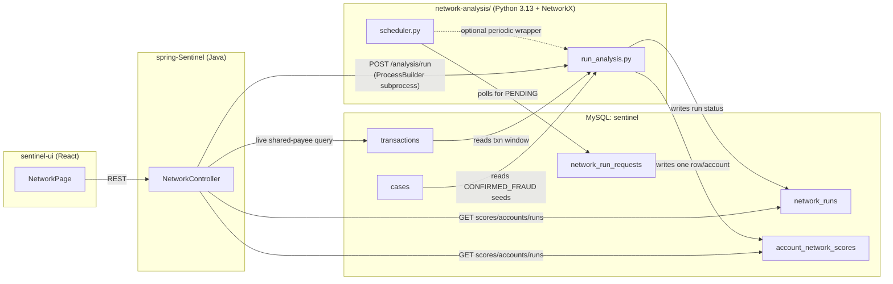

# Network Analysis Feature

What it is, why it exists, and exactly how it works end to end - Spring Boot
side, Python/NetworkX side, DB schema, and the React UI. This is a **routine
(batch) fraud-detection feature**, not a real-time one - it deliberately runs
separately from the per-transaction `RiskEngine`/`RiskRule` pipeline described
in [transaction_monitoring.md](../transaction_monitoring.md) and
[RiskLogic.md](RiskLogic.md).

## 1. Why this exists

The core rule engine (Amount Anomaly, Velocity, New Payee, etc.) looks at
**one account at a time, one transaction at a time**. It cannot see patterns
like "these 6 accounts all pay the same handful of payees" or "this account is
one hop away from a confirmed fraud case" - those are *relationship* signals
that only emerge when you look at the whole graph of accounts and payees
together.

Network Analysis fills that gap: a standalone batch job builds a graph of
which accounts transact with which payees, runs graph-science algorithms over
it (community detection, personalized PageRank, etc.), and produces a
`network_risk_score` (0-100) per account with a human-readable explanation.
It is explicitly **not** wired back into the live `RiskEngine` - see
"Deliberately out of scope" at the bottom.

## 2. Architecture at a glance



Python and Spring integrate **only through MySQL and one subprocess call** -
there is no shared code, no shared process, no message queue. This keeps the
two languages fully decoupled: Python could be replaced/rewritten without
touching Java, as long as it still writes to the same three tables.

## 3. The graph model (what "network" actually means here)

The `transactions` table only has `account_id -> payee_id` edges - there is
**no** `account_id -> account_id` edge anywhere in the schema. So:

1. **Bipartite graph**: nodes are `("A", account_id)` and `("P", payee_id)`;
   an edge exists for every transaction between them
   ([graph_builder.py](../network-analysis/graph_builder.py) `build_bipartite_graph`).
2. **Account-account projection**: two accounts get an edge if they share at
   least one payee, weighted by how much/how recently they both used it
   (`project_to_account_graph`):

   ```
   edge_weight(account) = 0.6 * frequency_score + 0.4 * recency_score
   frequency_score      = log1p(txn_count) * log1p(total_amount)   # log-dampened so a few big legit txns don't dominate
   recency_score        = how close to "now" the account's most recent txn on that payee is (0-1, within the lookback window)
   ```

   The final edge weight between two accounts is the **sum** of each
   account's individual weight on that shared payee, and multiple shared
   payees accumulate onto the same edge (`shared_payees` count increments).

This is a **projection through shared payees, not a literal money-transfer
graph**. A "dense community" means "structurally similar/interconnected
accounts" (e.g. a ring of accounts all paying the same handful of merchants),
never "circular transactions" or "transfer chains" - the schema simply
doesn't have the data to claim that.

## 4. The five signals (and how they're combined)

Each signal is computed in [algorithms.py](../network-analysis/algorithms.py),
then converted to a **percentile rank (0-100)** in
[scoring.py](../network-analysis/scoring.py) before weighting - this matters
because raw values from different algorithms aren't comparable (e.g. raw
PageRank values sum to 1 across the whole graph and shrink as the graph
grows), so "top 5% of accounts on this signal" means the same thing run to
run regardless of graph size.

| Signal (config key) | Weight | What it measures | Computed by |
|---|---|---|---|
| `fraud_exposure` | **0.40** | Personalized PageRank seeded from accounts with a `cases` row `status=CLOSED AND resolution_reason_code=CONFIRMED_FRAUD` - "how close is this account, graph-wise, to a confirmed fraud account". Falls back to uniform PageRank if there are no confirmed-fraud seeds yet (cold start). | `personalized_pagerank` |
| `shared_payee_concentration` | 0.20 | Max fan-in of any single payee this account uses - i.e. is this account transacting with a payee that many *other* accounts also use. | `payee_concentration` |
| `community_membership` | 0.15 | Percentile rank of this account's Louvain community **size** - bigger structurally-linked groups score higher. | `detect_communities` |
| `relationship_growth` | 0.15 | Fraction of this account's distinct payees (in the lookback window) that are brand new (first seen in the most recent third of the window) - a sudden burst of new payees is more suspicious than one new payee. | `relationship_growth` |
| `dense_cluster` | 0.10 | Binary: is this account's community at or above `DENSE_COMMUNITY_MIN_SIZE` (default 5)? | derived from community size |

```
network_risk_score = Σ (percentile_rank(signal) * weight) / Σ(weights)     # 0-100, rounded to 2dp
```

Weights live in `SIGNAL_WEIGHTS` in
[config.py](../network-analysis/config.py) and must sum to 1.0.
`FLAGGED_SCORE_THRESHOLD` (default 60.0) only controls the operator-facing
"accounts flagged" summary count in `network_runs` - **every** analyzed
account gets a score row regardless of whether it clears the threshold.

A **deterministic, template-based** (not LLM-generated) `network_reason`
sentence is produced per account by `scoring.generate_reason()` - same inputs
always produce the same sentence, which keeps the explanation reproducible
and auditable, e.g.:

> "High network exposure score (top 21% of accounts) due to proximity to 1
> confirmed-fraud account(s). Shares 10 payee relationship(s) with other
> accounts (top 21% by shared-payee concentration). Member of a dense
> interconnected account group containing 6 account(s)."

## 5. Run lifecycle (`run_analysis.py`)

Every run is **fully stateless** - nothing is remembered in the Python
process between runs; everything needed comes fresh from the DB each time:

1. `db.start_run()` inserts a `network_runs` row with `status=RUNNING`.
2. Fetch all transactions within `--lookback-days` (default 30).
3. Build the bipartite graph + account-account projection (see §3).
4. Fetch confirmed-fraud seed accounts from `cases`.
5. Compute all five signals, percentile-rank them, combine into
   `network_risk_score`, generate the reason sentence.
6. Bulk-insert **one row per analyzed account** into
   `account_network_scores` (all at once, only after every signal has been
   computed in memory - never a partially-written run).
7. `db.complete_run()` marks the run `COMPLETED` with
   `accounts_analyzed`/`accounts_flagged` counts.
8. Any exception anywhere -> `db.fail_run()` marks the run `FAILED` with the
   full Python traceback in `error_message`, then re-raises (so the calling
   process/subprocess sees a non-zero exit code too).

Run it manually any time from `network-analysis/` (venv active):

```
python run_analysis.py --lookback-days 30 --trigger MANUAL
```

## 6. Two ways a run gets triggered

### a) Manual - "Run Analysis Now" button (current default, synchronous)

`NetworkController.requestRun()` (`POST /api/network/analysis/run`) uses a
Java `ProcessBuilder` to launch
`network.python.executable run_analysis.py --lookback-days N --trigger MANUAL`
directly, in `network.python.script-dir`, and **blocks the HTTP request**
until the subprocess exits (draining its stdout the whole time to avoid a
pipe-buffer deadlock, with a `network.python.timeout-seconds` timeout -
default 120s - after which the process is force-killed and a 504 returned).

Once the subprocess exits, Spring queries `network_runs` for the most
recently-started row (the one the subprocess itself just wrote via
`start_run`/`complete_run`/`fail_run`) and returns the **actual result**
(`runId`, `status`, `accountsAnalyzed`, `accountsFlagged`, `errorMessage`) -
not just an "accepted" acknowledgement. HTTP 200 on success, 500 on
FAILED/exception, 504 on timeout.

This was a deliberate simplification over a DB-mediated queue: for this
project's data volume the whole analysis finishes in 1-3 seconds, so blocking
one request thread for that long is simpler and more honest UX than requiring
a separately-running poller process just to react to a button click.

Relevant config (`application.properties`, absolute paths because `mvnw` vs
IDE "Run" use different working directories - override via
`NETWORK_PYTHON_EXECUTABLE`/`NETWORK_PYTHON_SCRIPT_DIR` env vars):

```properties
network.python.executable=${NETWORK_PYTHON_EXECUTABLE:.../network-analysis/.venv/Scripts/python.exe}
network.python.script-dir=${NETWORK_PYTHON_SCRIPT_DIR:.../network-analysis}
network.python.timeout-seconds=120
```

### b) Scheduled - `scheduler.py` (optional, still queue-based)

A separate long-running Python process you can start independently
(`python scheduler.py`). Every `NETWORK_POLL_INTERVAL_SECONDS` (default 300)
it:

1. Checks `network_run_requests` for a `PENDING` row and runs immediately if
   found, marking it `DONE` afterward (this table/flow now exists only for
   this scheduled-side polling path - the manual button no longer writes to
   it, see §6a).
2. Otherwise runs on its own cadence once
   `NETWORK_SCHEDULED_INTERVAL_MINUTES` (default 60) has elapsed since its
   last run.

This is the **only stateful piece** of the whole feature (it remembers "when
did I last run" in memory), and even that's disposable - if the process
dies, restarting it just resumes polling; no in-progress run state is lost
because a run either completes and writes its rows, or fails and marks
itself `FAILED`.

If you don't want a long-running process at all, skip `scheduler.py` entirely
and schedule `python run_analysis.py --trigger SCHEDULED` directly via
Windows Task Scheduler / cron - functionally equivalent, minus automatic
pickup of manual run requests (which isn't needed anymore anyway, see §6a).

## 7. Database schema

| Table | Written by | Read by | Purpose |
|---|---|---|---|
| `network_runs` | Python (`start_run`/`complete_run`/`fail_run`) | Spring (`NetworkRunRepository`, read-only) | One row per execution: `run_id`, `started_at`, `completed_at`, `status` (RUNNING/COMPLETED/FAILED), `trigger_type` (MANUAL/SCHEDULED), `lookback_days`, `algorithm_version`, `accounts_analyzed`, `accounts_flagged`, `error_message`. Append-only - a run's row is only ever updated by that same run. |
| `account_network_scores` | Python (`insert_account_scores`, bulk) | Spring (`AccountNetworkScoreRepository`, read-only) | One row **per account per run** (append-only, never overwritten/updated): `run_id`, `account_id`, `network_risk_score`, `page_rank_percentile`, `shared_payee_count`, `community_id`, `community_size`, `growth_score`, `fraud_exposure_score`, `evidence_json` (raw per-signal values), `network_reason` (the generated sentence), `computed_at`. `account_id` is a plain int column, not a JPA `@ManyToOne`, so the Python side only needs to know an integer to write a row. |
| `network_run_requests` | Spring (legacy path, unused by current manual flow) / read by Python | Python `scheduler.py` polls it | `PENDING`/`DONE` request rows for the scheduled-poller path only (see §6b) - not used by the manual "Run Analysis Now" button anymore. |

All three tables are created automatically by Hibernate
(`spring.jpa.hibernate.ddl-auto=update`) from their entity classes - no manual
migration needed.

## 8. REST API (`NetworkController`, base path `/api/network`)

| Method & path | Purpose |
|---|---|
| `GET /scores?minScore=&page=&size=` | Ranked accounts from the **latest COMPLETED run only**, optionally filtered by minimum score. |
| `GET /accounts/{id}` | Latest score + evidence for one account, plus its full score-over-time history (one point per past run) for a timeline chart. |
| `GET /accounts/{id}/graph` | Small, LIMIT-bounded shared-payee neighborhood subgraph for one account - computed **live** from `transactions` (via `TransactionRepository.findSharedPayeeNeighbors`, native query), not from the batch job's output. Bounded by `network.graph.lookback-days` (default 90) and `network.graph.max-neighbors` (default 30, via `Pageable`) so it stays cheap. |
| `GET /runs?page=&size=` | Run history (freshness/staleness) for the operator, newest first. |
| `POST /analysis/run` | Operator-triggered "Run Analysis Now" - see §6a. Body: `{"lookbackDays": 30}` (optional, defaults to 30). |

## 9. Frontend (`sentinel-ui/src/components/network/`)

- **`NetworkPage.jsx`** - orchestrator. Loads scores + latest run on mount,
  owns the "Run Analysis Now" button's `runNow()` handler (calls
  `requestNetworkRun()`, then immediately calls `loadScores()` again once it
  resolves so the summary cards/table refresh with the just-completed run's
  data - no manual page reload needed).
- **`NetworkSummaryCards.jsx`** - "Accounts Analyzed", "Accounts Flagged",
  "Clusters Detected", "Last Analysis Run" cards.
- **`NetworkScoreTable.jsx`** - ranked account list, click a row to select it.
- **`NetworkAccountDetail.jsx`** - evidence breakdown + score-over-time
  timeline for the selected account.
- **`NetworkGraphView.jsx`** - small dependency-free custom SVG
  circular-layout view of the selected account's shared-payee neighborhood
  (no graph-visualization npm package added).
- **`src/api/networkApi.js`** - thin fetch wrappers for all 5 endpoints above.

## 10. Setup / running it locally

```
cd network-analysis
python -m venv .venv
.venv\Scripts\activate
pip install -r requirements.txt        # includes networkx, python-louvain, scipy, pandas, sqlalchemy, pymysql, python-dotenv
copy .env.example .env                 # fill in NETWORK_DB_* creds (see .env.example for the recommended least-privilege MySQL user)
python run_analysis.py --lookback-days 30 --trigger MANUAL
```

Required pip dependency worth calling out: **`scipy`** -
`networkx.pagerank`'s default backend imports it internally; missing it only
fails at runtime inside `personalized_pagerank()`, not at import time or in
static analysis.

The "Run Analysis Now" button in the UI does all of this for you via the
`ProcessBuilder` subprocess call described in §6a - no need to run
`run_analysis.py` by hand unless you want to test the Python side in
isolation.

## 11. Deliberately out of scope

- **Not wired into the real-time `RiskEngine`.** A `NetworkExposureRule` that
  would feed `network_risk_score` back into the per-transaction rule pipeline
  was discussed but intentionally not implemented - this feature stays a
  separate, routine/batch signal for now.
- **Not a literal transaction-flow graph.** See §3 - everything here is a
  shared-payee projection, never a claim about direct money movement between
  accounts.
