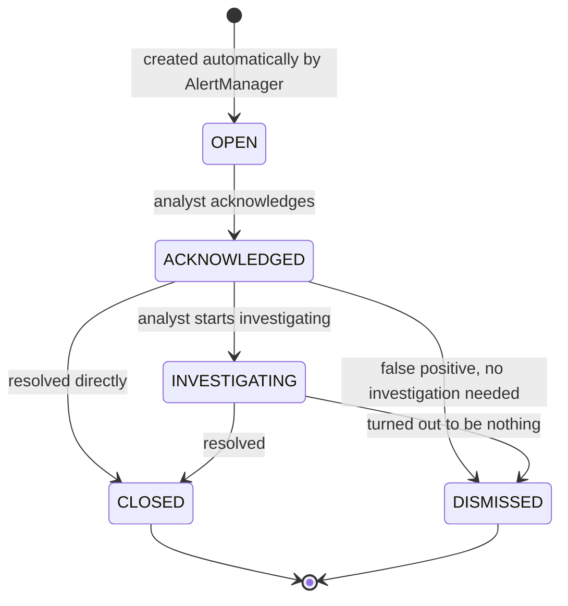

# Sentinel Backend — Super Deep Dive (Every Component Explained)

This document goes **line-by-line deep** into the Spring Boot backend (`spring-Sentinel/`).
Where [PROJECT_DOCUMENTATION.md](PROJECT_DOCUMENTATION.md) gives you the "big picture" tour,
this file is meant to be the one you read if someone grills you with follow-up questions like
*"okay but WHY does it work that way"* or *"what exactly happens in this class"*.

Everything is explained in plain words first, then backed up with the actual code logic so you
can trace it yourself.

---

## Table of Contents

1. [The One-Sentence Mental Model](#1-the-one-sentence-mental-model)
2. [Package-by-Package, File-by-File Deep Dive](#2-package-by-package-file-by-file-deep-dive)
3. [The Full Life of ONE Transaction (super detailed)](#3-the-full-life-of-one-transaction-super-detailed)
4. [The Database Entities — every table, every field, why it exists](#4-the-database-entities--every-table-every-field-why-it-exists)
5. [The Risk Engine — every single rule explained (super deep)](#5-the-risk-engine--every-single-rule-explained-super-deep)
6. [The Historical Profile — the "memory" behind the rules](#6-the-historical-profile--the-memory-behind-the-rules)
7. [The Alert Manager — deciding what becomes an alert](#7-the-alert-manager--deciding-what-becomes-an-alert)
8. [The Case Lifecycle State Machine](#8-the-case-lifecycle-state-machine)
9. [Why Async? The Event System Explained](#9-why-async-the-event-system-explained)
10. [Caching — what's cached, what's never cached, and why](#10-caching--whats-cached-whats-never-cached-and-why)
11. [Concurrency & Locking (the tricky part)](#11-concurrency--locking-the-tricky-part)
12. [Error Handling — the safety net](#12-error-handling--the-safety-net)
13. [Every Controller / REST Endpoint Explained](#13-every-controller--rest-endpoint-explained)
14. [The Transaction Simulator](#14-the-transaction-simulator)
15. [The AI Chatbot](#15-the-ai-chatbot)
16. [Seed Data — how the DB gets its starting rows](#16-seed-data--how-the-db-gets-its-starting-rows)
17. [Configuration Files Explained](#17-configuration-files-explained)
18. [Known Quirks, Dead Code, and Gotchas](#18-known-quirks-dead-code-and-gotchas)
19. [Rapid-Fire Q&A Cheat Sheet](#19-rapid-fire-qa-cheat-sheet)

---

## 1. The One-Sentence Mental Model

**A transaction comes in → gets saved immediately → gets scored by a set of independent rules
in the background → if the score is high enough, an Alert (and maybe a Case) gets created → a
human analyst works that Case through a fixed set of stages until it's resolved.**

Everything in this backend exists to support one of those five steps.

---

## 2. Package-by-Package, File-by-File Deep Dive

This section is the "teach me everything" version. For every folder, you'll get: what it's for,
**every single file in it**, and what that file actually does. Read this like a guided tour.

```
com.example
├── controller/     REST API endpoints (the "front door" - HTTP in, JSON out)
├── service/         General business logic (transactions, chatbot, simulator, seeding)
├── entity/          JPA @Entity classes - one per database table
├── enums/           Fixed value lists (statuses, types) shared by entities/DTOs
├── dto/              Request/Response shape objects (what the API actually sends/receives)
├── event/            The internal "message" system (decouples saving from scoring)
├── exception/        Custom exceptions + the global error handler
├── repository/      Spring Data JPA interfaces (the actual DB queries)
└── riskengine/       The fraud-detection brain, split into its own sub-package:
    ├── engine/        RiskEngine - runs all rules, produces a score
    ├── rules/         One class per individual fraud rule
    ├── model/          Plain data-holder classes passed between engine pieces
    ├── service/        HistoricalProfileService, RiskEvaluationService (orchestration)
    ├── alert/          AlertManager - turns a score into an Alert/Case
    ├── config/         AlertConfig (DB-backed settings), RuleConfig (legacy/unused)
    └── repository/     DEAD leftover code, never actually used (explained below)
```

**Why is `riskengine` its own sub-package instead of just more of `service`/`entity`?** Because
it was ported from an earlier standalone fraud-detection prototype (`backend/`) that the team
had already built and tested — the comments throughout the code literally say "ported from
backend/'s com.frauddetection.X". Keeping the same internal shape made porting faster and kept
the fraud-scoring logic clearly separated from generic CRUD/API code.

### 2.1 `controller/` — the front door

**Mental model:** a controller's ONLY job is to translate HTTP ↔ Java. It reads the URL/JSON,
calls into a service or repository to do the real work, and turns the result back into
JSON + an HTTP status code. A well-written controller has almost no "thinking" in it — if you see
real business logic (loops, calculations, decisions) sitting inside a controller method, that's
usually a sign it should have been pushed down into a service instead.

| File | What it exposes | Notable detail |
|---|---|---|
| `TransactionController` | `POST /api/transactions`, `GET /api/transactions` (paginated + 9 optional filters), `GET /api/transactions/{id}` | Builds a `TransactionFilter` record from up to 9 separate `@RequestParam`s and hands it to `TransactionService` — the controller itself doesn't know HOW filtering works, just what parameters exist. |
| `AlertController` | `GET /api/alerts`, `GET /api/alerts/{id}`, `GET /api/alerts/{id}/evaluations` | Pure read-only — alerts are never created here, only ever by `AlertManager` internally. The `/evaluations` route is handy for debugging: "show me every rule's verdict for the transaction behind this alert." |
| `CaseController` | `GET /api/cases`, `GET /api/cases/{id}`, `GET /api/cases/{id}/alerts`, `PATCH .../acknowledge`, `.../investigate`, `.../close`, `.../dismiss`, `GET /api/cases/stats` | The only controller that calls into `AlertManager`'s lifecycle methods. Has its **own** local `@ExceptionHandler` for `InvalidCaseTransitionException` (see section 12) — this takes priority over the app-wide `GlobalExceptionHandler` for this one controller. |
| `RuleController` | Full CRUD on `/api/rules` | Every mutating endpoint (`POST`/`PATCH`/`DELETE`) is annotated `@CacheEvict("activeRules")` — if you ever add a new mutation here and forget this annotation, your edit would silently not take effect for up to 60 seconds (the cache TTL). |
| `AlertSettingsController` | `GET`/`PUT /api/alert-settings` | Delegates the `GET` to `AlertConfig.getSettings()` (not the raw repository) specifically so a brand-new database with no settings row yet still returns sensible defaults instead of a 404. |
| `AccountController` | `POST`/`GET`/`GET-by-id`, plus `GET /api/accounts/{id}/transactions` | `POST` looks up the parent `Customer` first and throws `ResourceNotFoundException` if it doesn't exist — you cannot create an "orphan" account. |
| `CustomerController` | `POST`/`GET`/`GET-by-id` | The simplest controller in the app — customers have no required parent entity. |
| `PayeeController` | `POST`/`GET`/`GET-by-id` | Same shape as `CustomerController`. |
| `SimulatorController` | `POST /api/simulator/start`\|`stop`, `GET /api/simulator/status`, `POST /api/simulator/trigger/{scenario}` | Doesn't touch the database at all itself — every call just delegates to methods on the `TransactionSimulator` **service** bean. |
| `ChatbotController` | `POST /api/chatbot/ask` | Does exactly one piece of validation itself (rejects a blank question with 400) before delegating everything else to `ChatbotService`. |
| `NetworkController` | `GET /api/network/scores`, `.../accounts/{id}`, `.../accounts/{id}/graph`, `.../runs`, `POST /api/network/analysis/run` | The most complex controller — it also contains `@Value`-injected config (Python executable path, timeout) and uses `ProcessBuilder` to actually launch an external Python process. This is the one controller that does more than "thin HTTP translation," because launching/waiting on a subprocess is inherently part of serving that specific request. |

### 2.2 `service/` — the general business logic

Anything that doesn't fit neatly into "it's a rule" or "it's fraud-scoring logic" (that's what
`riskengine/` is for) lives here instead.

| File | What it does | Deep detail |
|---|---|---|
| `TransactionService` | Creates transactions (validates account/payee exist, builds+saves the entity, fires the async event), lists/filters transactions, fetches one by ID, and — importantly — **recomputes the risk score on every GET** by reading back the stored `RuleEvaluation` rows (since the original POST response never had it). | This is the single most important service in the whole app — nearly everything else exists to support it. |
| `TransactionSimulator` | The scheduled fake-data generator (full breakdown in section 14). | Uses `@PostConstruct` to read the `simulator.enabled` property once at boot, but keeps its actual on/off `running` flag in an `AtomicBoolean` so `start()`/`stop()` calls from `SimulatorController` are thread-safe without needing a lock. |
| `SeedDataService` | One-time startup data seeding (full breakdown in section 16). | Runs via `@PostConstruct`, guarded by `if (repository.count() == 0)` per table — so it's safe to restart the app repeatedly without duplicating seed rows, but it will NOT retroactively fix a seed value you changed in code if the table already has rows. |
| `ChatbotService` | Calls the external Groq LLM API, grounded only in local files + the live `rules` table (full breakdown in section 15). | Loads its "knowledge" text files once at startup (`@PostConstruct`) rather than re-reading them from disk on every single question — a small but deliberate performance choice. |

### 2.3 `entity/` — one class per database table

**Mental model:** an `@Entity` class is a direct, 1-to-1 Java mirror of one MySQL table. Every
field maps to a column; every `@ManyToOne` maps to a foreign key. Hibernate uses these classes to
both read/write rows AND (because `ddl-auto=update` is on) to auto-create/alter the actual table
structure at startup.

Full table already covered in [section 4](#4-the-database-entities--every-table-every-field-why-it-exists)
— the short version to remember here: **13 entity classes = 13 tables Hibernate actively manages.**
Every entity in this project uses **hand-written getters/setters** (no Lombok — see section 18),
and every entity that needs its `createdAt`/timestamp-style fields defaulted uses a `@PrePersist`
method (runs automatically right before the very first INSERT) rather than relying on a database
default, so the value is guaranteed to always be set from the JVM's own clock in UTC.

### 2.4 `enums/` — the fixed value lists

**Mental model:** wherever the database has a column that can only ever be one of a handful of
specific words (like a status), that's an `enum` here, not a plain `String`. This means invalid
values are rejected by the Java compiler itself, not just by a database constraint.

| Enum | Values | Used by |
|---|---|---|
| `TransactionType` | `DEBIT`, `CREDIT` | `Transaction.type` |
| `TransactionStatus` | `COMPLETED`, `PENDING`, `FAILED` | `Transaction.status` |
| `TransactionSource` | `API`, `SIMULATOR` | Passed as a plain method parameter (never persisted — see section 18's "no `source` column" note) |
| `AccountType` | `CHECKING`, `SAVINGS`, `CREDIT` | `Account.accountType` |
| `AccountStatus` | `ACTIVE`, `CLOSED`, `FROZEN` | `Account.status` |
| `RuleType` | `AMOUNT_ANOMALY`, `AMOUNT_THRESHOLD`, `VELOCITY`, `NEW_PAYEE`, `TIME_ANOMALY`, `DEVICE_CHANGE`, `LOCATION_CHANGE`, `SPENDING_PATTERN` | `Rule.ruleType` — matches each `RiskRule` implementation class one-to-one (except `DEVICE_CHANGE`, unimplemented) |
| `CaseStatus` | `OPEN`, `ACKNOWLEDGED`, `INVESTIGATING`, `DISMISSED`, `CLOSED`, plus legacy `IN_REVIEW`/`ESCALATED` values still in the enum for backward compatibility with old rows | `Case.status` AND `Alert.status` (both share this one enum) |
| `Severity` | `HIGH`, `MID`, `LOW` | `Case.severity` AND `Alert.severity` |
| `ResolutionReasonCode` | `CONFIRMED_FRAUD`, `FALSE_POSITIVE_KNOWN_CUSTOMER`, `FALSE_POSITIVE_RULE_TOO_SENSITIVE`, `LEGITIMATE_LARGE_PURCHASE`, `DUPLICATE_ALERT`, `INSUFFICIENT_EVIDENCE` | `Case.resolutionReasonCode` — structured data so the Python network job can reliably find "confirmed fraud" accounts without parsing free text |
| `QueueStatus` | `PENDING`, `PROCESSING`, `EVALUATED`, `FAILED` | `TransactionQueueStatus.queueStatus` (the evaluation audit trail, not a real queue) |
| `NetworkRunStatus` | `RUNNING`, `COMPLETED`, `FAILED` | `NetworkRun.status` |
| `NetworkRunTrigger` | `SCHEDULED`, `MANUAL` | `NetworkRun.triggerType` |
| `NetworkRunRequestStatus` | `PENDING`, `PICKED_UP`, `DONE` | `NetworkRunRequest.status` (legacy polling hand-off table — section 18) |

**Why does `CaseStatus` still contain `IN_REVIEW`/`ESCALATED` even though the current workflow
never sets them?** Historical reasons — the enum used to be exactly those 4 values
(`OPEN`/`IN_REVIEW`/`ESCALATED`/`CLOSED`) before being migrated to the current 5-value spec-aligned
set. The old values are kept in the enum (rather than deleted) so any pre-existing database rows
with those old status strings can still be read without crashing — deleting them would make any
old row throw `IllegalArgumentException: No enum constant` the instant Hibernate tried to map it.

### 2.5 `dto/` — the API's actual "shape" contract

**Mental model:** DTO = Data Transfer Object. These are NOT entities — they're separate classes
that define exactly what JSON shape goes over the wire, in each direction. Why not just serialize
entities directly? Because an entity might contain internal fields you don't want to expose (or
might contain a lazy-loaded relationship that would crash serialization), and a request body often
needs to accept LESS than what the full entity has (system-generated fields like IDs/timestamps
shouldn't be settable by the caller).

| DTO | Direction | Purpose |
|---|---|---|
| `TransactionRequest` | Request (in) | What a caller sends to create a transaction — deliberately excludes `transactionId`, `createdAt`, `status` (all system-assigned). |
| `TransactionResponse` | Response (out) | Everything about a transaction INCLUDING risk engine output (`riskScore`, `triggeredRules`, `evidence`) and alert/case linkage (`alertId`, `caseId`, etc.) — built with a hand-written `Builder` (no Lombok). |
| `TransactionFilter` | Internal (controller → service) | A `record` (Java's built-in immutable data-holder syntax) bundling all 9 optional GET-filter parameters together so they don't have to be passed as 9 separate method arguments. |
| `RuleRequest` | Request (in) | Uses **boxed types** (`Boolean`, `Integer`, not `boolean`/`int`) deliberately — so a `PATCH` can tell "field not included in the JSON body at all" apart from "field explicitly set to `false`/`0`". |
| `CaseStatsResponse` | Response (out) | Dashboard aggregate stats: count of cases per status, average minutes-to-acknowledge, average minutes-to-close, total case count. |
| `AccountRequest`, `CustomerRequest`, `PayeeRequest` | Request (in) | Simple 1-to-1 "what fields can you set when creating this" shapes. |
| `ChatRequest` / `ChatResponse` | Request/Response | Just wrap a single `question`/`answer` string each. |
| `NetworkScoreResponse` | Response (out) | One account's network-risk-score row (matches `AccountNetworkScore` closely, but adds `accountNumber` for display and passes `evidence` JSON through as a raw string). |
| `NetworkAccountDetailResponse` | Response (out) | Bundles the *latest* `NetworkScoreResponse` plus a `List<NetworkTimelinePoint>` (its score history over time). |
| `NetworkTimelinePoint` | Response (out) | One `(runId, computedAt, networkRiskScore)` triple — literally just the points needed to draw a line chart. |
| `NetworkGraphResponse` (+ nested `NetworkGraphNode`/`NetworkGraphEdge`) | Response (out) | The small "shared payee neighborhood" subgraph around one account, for the frontend's graph visualization. |
| `NetworkRunResponse` | Response (out) | One row of run history (started/completed time, status, trigger type, accounts analyzed/flagged, error message if failed). |

**Why do some DTOs use `record` and others use a plain class with getters/setters?** The `record`
ones (`TransactionFilter`, and most of the `Network*Response` DTOs) are pure, immutable,
output-only or internal-only data — records are Java's modern, terse way to write that with zero
boilerplate. The plain-class ones are either request bodies (need mutable setters for Jackson's
JSON deserialization, and the "no Lombok" convention pre-dates this project's use of records in
new files) or response DTOs built by hand with an explicit `Builder`.

### 2.6 `event/` — the internal message system

Only two files, but they're the backbone of the whole "decoupled scoring" design (full mechanics
in [section 9](#9-why-async-the-event-system-explained)):

| File | Role |
|---|---|
| `TransactionCreatedEvent` | Just an envelope (extends Spring's `ApplicationEvent`) carrying the saved `Transaction` object. It does nothing by itself — it's inert data. |
| `TransactionEventListener` | The one and only place that reacts to that event. Combines `@Async` (run on a background thread) with `@TransactionalEventListener(phase = AFTER_COMMIT)` (don't even start until the save is truly durable) to safely trigger `RiskEvaluationService.evaluate()`. |

**Why use Spring's built-in event system instead of, say, a real message queue (Kafka/RabbitMQ)?**
This project doesn't need cross-process/cross-server messaging — everything runs in one JVM. An
in-process `ApplicationEventPublisher` gives the exact same "decouple the caller from the work"
benefit with zero extra infrastructure to install/run/monitor. If this app ever needed to scale to
multiple server instances sharing one workload, THAT would be the point to swap this for a real
external queue.

### 2.7 `exception/` — custom errors + the safety net

| File | Role |
|---|---|
| `ResourceNotFoundException` | A plain `RuntimeException` subclass, thrown anywhere an entity lookup fails (missing account/customer/payee/transaction). Carries just a message — no extra fields needed. |
| `GlobalExceptionHandler` | An `@RestControllerAdvice` — a special Spring annotation meaning "this class's methods apply to EVERY controller in the app automatically." Each `@ExceptionHandler` method here catches one specific exception type and converts it to a consistent JSON error shape + HTTP status. Full mapping table in [section 12](#12-error-handling--the-safety-net). |

There's also `InvalidCaseTransitionException`, but it deliberately lives in
`riskengine.alert` (right next to `AlertManager`, the only class that throws it) instead of here
— a reminder that "exception" isn't a rigid folder rule, it's wherever makes the most sense for a
tightly-coupled piece of domain logic.

### 2.8 `repository/` — the actual database queries

**Mental model:** each interface here extends Spring Data JPA's `JpaRepository<EntityType, IdType>`,
which means you get `save()`, `findById()`, `findAll()`, `delete()`, etc. **completely for free** —
you never write the SQL for those. You only need to add a method signature for anything CUSTOM,
and Spring Data either (a) auto-generates the query from the method name itself (e.g.
`findByAccountAccountIdAndTransactionTimestampBetween` builds a `WHERE account.account_id = ? AND
transaction_timestamp BETWEEN ? AND ?` query purely from the method's name), or (b) you write the
query yourself with `@Query(...)` (JPQL, not raw SQL) when the name-based approach gets too
complex or you need something name-derivation can't express (like a lock hint).

| Repository | Notable custom methods | Why they exist |
|---|---|---|
| `TransactionRepository` | `findByAccountAccountIdAndTransactionTimestampBetween`, `countByAccountAccountIdAndTransactionTimestampBetween`, native query `findSharedPayeeNeighbors` | Also extends `JpaSpecificationExecutor<Transaction>` — this is what unlocks the dynamic `Specification.where(...).and(...)` filter-building used by `TransactionSpecifications`/`TransactionService.getTransactions()`. The `count...` variant exists specifically so `VelocityAnomalyRule` can get a fast `COUNT(*)` without Hibernate loading full `Transaction` rows (and their EAGER `account`/`payee` joins) just to throw the data away. |
| `CaseRepository` | `findByAccountAccountIdAndStatusNotOrderByCreatedAtDesc`, `findByAccountForUpdate` (`@Lock(PESSIMISTIC_WRITE)`), plus 3 aggregate `@Query` methods for `/api/cases/stats` | `findByAccountForUpdate` is the single most important query in the concurrency story (section 11) — the `@Lock` annotation is what makes Hibernate emit `SELECT ... FOR UPDATE` instead of a plain `SELECT`. |
| `AlertRepository` | `findFirstByACaseCaseIdOrderByCreatedAtDesc`, `findByTransactionTransactionId`, `findByACaseCaseIdOrderByCreatedAtDesc`, `updateStatusByCaseId` (`@Modifying` + `@Query`) | `updateStatusByCaseId` is a **bulk update** query (`UPDATE Alert SET status = ... WHERE case_id = ...`) — it changes every Alert row for a case in one SQL statement instead of loading them all into Java objects first, which is both faster and simpler. `@Modifying(clearAutomatically = true)` tells Hibernate to drop its in-memory cache of those rows afterward so nothing reads stale data from the session cache. |
| `RuleRepository` | `findByActiveTrue` (`@Cacheable("activeRules")`) | The single most frequently called repository method in the whole app — runs on every transaction evaluation. |
| `RuleEvaluationRepository` | `findByTransactionTransactionId` | Powers both the GET-response score recomputation (`TransactionService`) and `AlertController`'s `/evaluations` endpoint. |
| `AccountRepository` | `findByCustomerCustomerId`, `findById` overridden with `@Cacheable("accounts")` | Caching `findById` specifically (not the whole repository) because that's the one method called on literally every transaction creation. |
| `PayeeRepository` | `findById` overridden with `@Cacheable("payees")` | Same reasoning as `AccountRepository`. |
| `CustomerRepository`, `TransactionQueueStatusRepository`, `AlertSettingsRepository` | None — plain `JpaRepository` | These entities only ever need the free CRUD methods, nothing custom. |
| `NetworkRunRepository` | `findFirstByStatusOrderByCompletedAtDesc`, `findAllByOrderByStartedAtDesc` | Finds "the latest COMPLETED run" (what `/api/network/scores` shows as "current") and paginated run history. |
| `AccountNetworkScoreRepository` | `findByRunIdAndNetworkRiskScoreGreaterThanEqualOrderByNetworkRiskScoreDesc`, `findByRunIdOrderByNetworkRiskScoreDesc`, `findByRunIdAndAccountId`, `findByAccountIdOrderByComputedAtAsc`, `countByRunId` | The `findByAccountIdOrderByComputedAtAsc` one powers the account "timeline" (score history over multiple runs). |
| `NetworkRunRequestRepository` | `findFirstByStatusOrderByRequestedAtAsc` | Legacy — used by the Python scheduler's own polling loop, not by the current "Run Analysis Now" button (see section 18). |
| `TransactionSpecifications` | *(not a repository interface — a static helper class)* | Provides one `Specification<Transaction>` builder method per optional filter field, each returning `null` (meaning "no constraint") if its argument is absent. `TransactionService.getTransactions()` chains all 9 of them together with `.and(...)`. |

### 2.9 `riskengine/` — the fraud brain, sub-package by sub-package

This is the deepest, most important part of the whole backend, so here's every single file,
individually, with no skipping:

#### `riskengine/engine/`
- **`RiskEngine.java`** — the conductor. Constructor-injects a `List<RiskRule>` (Spring
  auto-collects every `@Component`-annotated `RiskRule` implementation into this list) and
  immediately indexes them into a `Map<RuleType, RiskRule>` for instant lookup. Its one public
  method, `evaluate(transaction)`, is the entire "run every active rule and combine into one
  score" algorithm described in [section 3](#3-the-full-life-of-one-transaction-super-detailed),
  step 5, and [section 5](#5-the-risk-engine--every-single-rule-explained) in full mathematical detail.

#### `riskengine/rules/`
- **`RiskRule.java`** — the interface every rule implements. Just two methods:
  `getRuleType()` (which DB rule row this rule services) and `evaluate(...)` (do the actual check).
  This is the **Strategy design pattern** — `RiskEngine` doesn't know or care HOW any individual
  rule works internally, it just calls the same interface method on whichever implementation
  matches the current DB row's type.
- **`AmountAnomalyRule.java`**, **`AmountThresholdRule.java`**, **`VelocityAnomalyRule.java`**,
  **`NewPayeeRule.java`**, **`TransactionTimeRule.java`**, **`LocationChangeRule.java`**,
  **`SpendingPatternRule.java`** — the 7 concrete implementations, each covered individually with
  its exact formula in [section 5](#5-the-risk-engine--every-single-rule-explained). Every single
  one is a tiny, self-contained, independently-testable class — none of them know about each
  other or about `RiskEngine`'s existence.

#### `riskengine/model/`
Pure data-holder classes — no logic, just fields + getters, passed between the engine's pieces:
- **`RuleResult.java`** — one rule's verdict: `ruleName`, `triggered` (boolean), `score` (0.0–1.0),
  `reason` (human-readable string).
- **`RiskResult.java`** — the FULL output of one transaction's evaluation: the final 0–100
  `riskScore`, the complete `List<RuleResult>` (every rule, triggered or not), plus a convenience
  `getTriggeredRules()` method that filters down to just the ones that fired.
- **`HistoricalProfile.java`** — an account's behavioural baseline snapshot (mean/stddev amount,
  known payees/locations/categories, normal active hours) — full breakdown in
  [section 6](#6-the-historical-profile--the-memory-behind-the-rules).
- **`Alert.java`, `AlertSeverity.java`, `AlertStatus.java`** — ⚠️ **these three are DEAD CODE**,
  literally ported-but-unused leftovers from the original standalone prototype. The REAL alert
  representation the app actually uses is `com.example.entity.Alert` (a JPA entity). This
  in-package `Alert` is a plain in-memory object with no database mapping at all — nothing in the
  live application ever constructs one. See section 18 for the full "dead code" list.

#### `riskengine/service/`
- **`HistoricalProfileService.java`** — builds the `HistoricalProfile` described above, from real
  `Transaction` rows via `TransactionRepository`, cached 15 seconds per account. Full breakdown in
  section 6.
- **`RiskEvaluationService.java`** — the orchestrator called by `TransactionEventListener`. Writes
  the `TransactionQueueStatus` audit rows, calls `RiskEngine` then `AlertManager` in sequence, and
  wraps both in a try/catch that marks the audit row `FAILED` (with an incremented retry count) on
  any exception, then re-throws so the caller (`TransactionEventListener`) still logs it too.
- **`EvaluationOutcome.java`** — a tiny wrapper bundling `RiskResult` + `Optional<Alert>` together
  as ONE return value from `RiskEvaluationService.evaluate()`.

#### `riskengine/alert/`
- **`AlertManager.java`** — the single most complex class in the app: decides whether a score
  becomes an alert, finds-or-creates/merges Cases, and owns the entire case lifecycle state
  machine (`acknowledge`/`investigate`/`close`/`dismiss`). Full breakdown in sections 7, 8, and 11.
- **`InvalidCaseTransitionException.java`** — thrown by `AlertManager` when a lifecycle
  transition isn't legal (e.g. closing an already-closed case). Deliberately lives right next to
  `AlertManager` (not in the generic `exception/` package) since it's tightly tied to that one
  class's business rule, not a generic app-wide error type.

#### `riskengine/config/`
- **`AlertConfig.java`** — the REAL, currently-used settings source: reads the single
  `AlertSettings` DB row (cached), seeds sensible defaults if the row doesn't exist yet, and
  exposes `getMinScoreToCreateAlert()`, `getMergeCooldownMinutes()`, and `severityFor(score)` to
  `AlertManager`.
- **`RuleConfig.java`** — ⚠️ **legacy/unused.** A hardcoded Java class (its own docstring says
  *"HARD-CODED rule configuration... In production these values would be stored in a database"*)
  left over from before the `rules` DB table existed. Nothing in the live evaluation path reads
  from this class anymore — `Rule` entity rows via `RuleRepository` are what's actually used. If
  you ever change a number in `RuleConfig.java` expecting it to affect real behaviour, it won't.

#### `riskengine/repository/` — 100% DEAD CODE, explained in full
This entire sub-package (`AlertEntity.java`, `AlertJpaRepository.java`, `AlertRepository.java`
inside `riskengine.repository`) is explicitly marked `DEAD CODE` in its own file comments. It was
the *original* attempt at an Alert entity/repository (ported from the standalone prototype) before
the team switched to the real relational schema's `entity.Alert` + `repository.AlertRepository`.
To avoid a runtime collision (two different classes both trying to map/manage a table named
`alerts`, or two Spring beans both wanting the name "AlertRepository"), these were **deliberately
stripped** of their Spring/JPA annotations (`@Entity`, `@Repository`, `extends JpaRepository`)
so they're just inert plain Java classes that compile but are never instantiated or scanned by
Spring. **Nothing calls into this package.** It's kept around only as a historical trace, not
because it does anything.

---

## 3. The Full Life of ONE Transaction (super detailed)

Let's trace `POST /api/transactions` from the very first line to the very last, in order.

### Step 1 — The HTTP request arrives
`TransactionController.create()` receives a JSON body, deserializes it into a `TransactionRequest`
DTO (accountId, payeeId, amount, currency, type, description, location, merchantCategory).

### Step 2 — `TransactionService.createTransaction()` runs, inside a DB transaction (`@Transactional`)
1. Looks up the `Account` by ID — throws `ResourceNotFoundException` (→ HTTP 404) if it doesn't exist.
2. Looks up the `Payee` by ID — same 404 behavior if missing.
3. Builds a `Transaction` entity using a hand-written `Builder` (Lombok isn't used anywhere in
   this codebase — see section 18 for why), defaulting `currency` to `"USD"` if not given,
   stamping `transactionTimestamp = now() (UTC)`, and `status = COMPLETED`.
4. Saves it via `TransactionRepository.save()` → MySQL auto-generates `transaction_id`.
5. **Publishes `TransactionCreatedEvent`** carrying the saved `Transaction`, then **returns
   immediately** to the caller with a `TransactionResponse` that has **no risk score yet**
   (`riskScore`, `triggeredRules`, etc. are all null/empty at this point).

**Why return before scoring is done?** So writing a transaction is always fast and never blocked
by how slow/expensive fraud-rule evaluation is. The HTTP caller gets a quick "yes, it's recorded"
response; the actual fraud check happens moments later on a separate thread.

### Step 3 — The event gets picked up (asynchronously, after commit)
`TransactionEventListener.onTransactionCreated()` is annotated with:
- `@TransactionalEventListener(phase = AFTER_COMMIT)` — this method does **not** run the instant
  the event is published. Spring holds it until the *database transaction that saved the
  Transaction row has actually committed*. This guarantees the listener never evaluates a
  transaction that could still be rolled back.
- `@Async("taskExecutor")` — runs on a background thread from the pool defined in `AsyncConfig`
  (6–16 threads named `sentinel-async-*`), so it never blocks the original HTTP request thread
  (which has already returned its response by now anyway).

### Step 4 — `RiskEvaluationService.evaluate()` orchestrates the actual check
1. Writes a `TransactionQueueStatus` row with status `PROCESSING` (an audit trail — see section 18,
   this is **not** a real queue, evaluation is still done synchronously within this one method call).
2. Calls `RiskEngine.evaluate(transaction)` → gets back a `RiskResult` (final score 0–100 + the
   list of individual rule results).
3. Calls `AlertManager.process(riskResult, transaction)` → may create an `Alert` (and possibly a
   new/merged `Case`), or return nothing if the score wasn't high enough.
4. Updates the `TransactionQueueStatus` row to `EVALUATED` (or `FAILED` + increments `retryCount`
   if something threw).

### Step 5 — `RiskEngine.evaluate()` — the actual scoring math
1. Fetches the account's `HistoricalProfile` (behavioural baseline — see section 6).
2. Fetches **all currently active rules** from the DB (`RuleRepository.findByActiveTrue()`,
   cached for 60 seconds — see section 10).
3. For **every** active rule:
   - Finds the matching Java implementation (`RiskRule`) for that rule's type.
   - If no implementation exists for that type (currently true for `DEVICE_CHANGE`), **skips it silently**.
   - Calls `ruleImpl.evaluate(transaction, profile, rule)` inside a `try/catch` — if a rule throws
     an unexpected exception, it's logged and treated as "didn't trigger, contributed 0" rather
     than crashing the whole evaluation for every other rule.
   - **Always** logs one `RuleEvaluation` audit row (triggered or not) — so you can see every
     rule's verdict on every transaction later, not just the ones that fired.
   - If the rule **triggered**, its `(score × weight)` is added to a running weighted sum, and its
     weight is added to a running total weight.
4. Final score = `round((weightedSum / totalWeight) × 100)`, clamped naturally to 0–100 since each
   rule's own score is normalized to 0.0–1.0. If **no** rule triggered, `totalWeight` is 0 and the
   final score is simply **0** (not a divide-by-zero crash — there's an explicit check).

**Why weighted average of only the triggered rules, not all rules?** So a rule that *didn't* fire
doesn't drag the score down just for existing — the score reflects "how bad are the problems that
WERE found", weighted by how much each contributing rule "counts".

### Step 6 — `AlertManager.process()` — deciding what to do with that score
Explained in full in section 7, but the short version:
- If score is below the configurable `minScoreToCreateAlert` (default 50) → do nothing, return.
- Otherwise, find-or-create a `Case` for this account (merging into a recent open case if one
  exists within the cooldown window), then **always** create one new `Alert` row linked to that case.

### Step 7 — Later: someone calls `GET /api/transactions/{id}` or `GET /api/transactions`
Since the original POST response never had the risk score (evaluation hadn't finished yet), GET
responses look up the `RuleEvaluation` rows for that transaction and **recompute** the same
weighted score from stored data, then include `riskScore`, `triggeredRules`, and `evidence`
(the human-readable reasons) in the response. If evaluation genuinely hasn't run yet, this just
comes back empty/zero — not an error, just "not evaluated yet."

---

## 4. The Database Entities — every table, every field, why it exists

| Entity | Table | What it represents |
|---|---|---|
| `Customer` | `customers` | A real person: name, email, phone, address. |
| `Account` | `accounts` | A bank account belonging to a customer (checking/savings, currency, status). |
| `Payee` | `payees` | Someone/something a transaction is paid to (merchant, person, biller). |
| `Transaction` | `transactions` | One money movement: amount, currency, type (DEBIT/CREDIT), timestamp, optional location/merchant category/description. |
| `Rule` | `rules` | One configurable fraud rule row (type, active flag, weight, threshold, timeline). Fully DB-editable — no redeploy needed to tune fraud sensitivity. |
| `RuleEvaluation` | `rule_evaluations` | Audit log: **every** rule's verdict against **every** transaction (triggered or not, score, human-readable reason). |
| `Alert` | `alerts` | One row per transaction that crossed the alert threshold. Always linked to a `Case`. |
| `Case` | `cases` | The actual "investigation" unit an analyst works — groups multiple related alerts for the same account together. Has its own lifecycle (see section 8). |
| `AlertSettings` | `alert_settings` | Single-row (id=1) config table: alert-creation threshold, severity bands, merge cooldown minutes. |
| `TransactionQueueStatus` | `transaction_queue_status` | Audit trail of the (synchronous, not really a queue) evaluation process — PENDING → PROCESSING → EVALUATED/FAILED. |
| `NetworkRun` | `network_runs` | One row per execution of the separate Python network-analysis batch job. Written by Python, read-only from Spring. |
| `AccountNetworkScore` | `account_network_scores` | One row per account **per network run** (append-only history) — the batch job's fraud-network risk score for that account. |
| `NetworkRunRequest` | `network_run_requests` | Legacy hand-off table for scheduling network runs (see section 18 — mostly superseded). |

**Why no Lombok anywhere (`@Data`, `@Builder`, `@Getter`, etc.)?** Every entity file has a
comment explaining this: Lombok silently failed to generate methods on the JDK version this
project was built with (JDK 25) — no error, just missing methods → confusing compiler errors.
Rather than chase Lombok version pins, every getter/setter/constructor/builder in this codebase
is hand-written.

**Why do `Transaction`/`Rule` have a hand-rolled `Builder` inner class but most other entities don't?**
Those two are the ones actually constructed with a fluent builder pattern elsewhere in the code
(`TransactionService`, `SeedDataService`). Entities that are only ever built via `new X()` +
setters didn't need one.

---

## 5. The Risk Engine — every single rule explained (super deep)

Each rule is a separate Spring `@Component` implementing the tiny `RiskRule` interface
(`getRuleType()` + `evaluate(transaction, profile, rule)` → `RuleResult`). This means adding a
new fraud rule is just: write a new class implementing this interface, and it's automatically
picked up (Spring collects all `RiskRule` beans into a list, and `RiskEngine` indexes them by
`RuleType` in its constructor). This is a textbook **Strategy pattern**: `RiskEngine` never has an
`if (ruleType == ...)` chain anywhere — it just calls `.evaluate(...)` on whichever implementation
matches, and has zero idea how any individual rule works internally.

Every rule returns a **normalized score between 0.0 and 1.0** plus a **boolean triggered** flag
plus a **plain-English reason string**. The `Rule` DB row supplies the actual threshold numbers
so behaviour can be tuned without touching code (change a row in the `rules` table → the next
transaction is evaluated with the new number, no redeploy needed).

### 5.0 First, how `RiskEngine.evaluate()` combines everything into ONE score

This is the part that ties all 7 rules together — read this first, then the individual rules
below will make more sense.

```java
for (Rule rule : activeRules) {                 // only rules with active = true in the DB
    RuleResult result = ruleImpl.evaluate(transaction, profile, rule);
    results.add(result);
    logEvaluation(transaction, rule, result);     // ALWAYS logged, triggered or not (see below)

    if (result.isTriggered()) {                   // only TRIGGERED rules count toward the score
        weightedSum += result.getScore() * rule.getWeight().doubleValue();
        totalWeight += rule.getWeight().doubleValue();
    }
}
int finalScore = totalWeight == 0 ? 0 : (int) Math.round((weightedSum / totalWeight) * 100);
```

In plain words: this is a **weighted average, but only over the rules that actually fired.** A
rule that didn't trigger contributes literally nothing to the average — not even a zero drags the
average down, because it's excluded from both the numerator AND the denominator. This matters a
lot: if only 1 out of 7 active rules triggers, and it triggers with a normalized score of 1.0, the
final score can be a full 100, regardless of the other 6 rules being calm. **The final score is
"how confident are the rules that DID fire," not "what fraction of all rules fired."**

Every single rule — triggered or not — gets written as one `RuleEvaluation` row (`logEvaluation`).
That's WHY `AlertController`'s `/evaluations` endpoint and `TransactionService`'s GET-response
recomputation both work: the complete history of every rule's verdict on every transaction is
permanently on disk, not just the ones that fired.

**Fault isolation:** each rule's `.evaluate(...)` call is individually wrapped in its own
try/catch inside the loop. If one specific rule throws an unexpected exception (say, a null
pointer on a weird edge-case transaction), only THAT rule's result becomes a safe "0.0, not
triggered, error: ..." placeholder — the other 6 rules still run normally and the transaction
still gets scored. One buggy rule can never take down the entire evaluation.

### 5.1 `AmountAnomalyRule` — "is this weird FOR THIS SPECIFIC ACCOUNT?"

```java
double zScore = (transaction.amount - profile.meanAmount) / profile.stdDevAmount;
double normalizedScore = clamp(zScore / (threshold * 3), 0, 1);
boolean triggered = zScore >= threshold;
```

This is a classic statistics **z-score**: "how many standard deviations away from this account's
own average transaction amount is this one?" If an account normally spends around $50 ± $20, and
suddenly spends $500, that's a huge z-score — clearly unusual **for that account**, even though
$500 might be perfectly normal for someone else. `rule.thresholdValue` is the z-score cutoff (a
typical seed value is `3.00`, meaning "3+ standard deviations away is suspicious" — in general
statistics, only about 0.1% of normal values fall further than 3 standard deviations from the
mean, so seeing one is a strong signal). The normalization formula caps the score at 1.0 once
you're 3× past the threshold, so a truly extreme outlier doesn't produce a meaningless score like
"47.0."

**Cold-start safety:** if `stdDevAmount` is `null` or exactly `0` (brand-new account, or an
account where every past transaction happened to be the exact same amount), the rule returns
`false, 0.0` immediately with the reason *"Insufficient history to compute amount deviation"* —
this avoids a division-by-zero crash and correctly reflects "we simply don't have enough data to
judge this yet."

### 5.2 `AmountThresholdRule` — "is this just a huge amount of money, period?"

```java
boolean triggered = amount.compareTo(threshold) > 0;
double normalizedScore = triggered ? clamp((amount / threshold) / 2.0, 0, 1) : 0.0;
```

No history involved at all — just "is this transaction over a flat dollar ceiling" (e.g.
$10,000). **Why does this need to exist separately from `AmountAnomalyRule`?** Because a
brand-new account has no standard deviation to compute a z-score from — `AmountAnomalyRule`
literally cannot fire for a fresh account (see cold-start handling above). But a scammer opening a
new account and immediately draining $50,000 through it on the very first transaction is EXACTLY
the kind of case that must still be caught. This rule is the safety net for that scenario — it
doesn't care about history at all, it just asks "is this an objectively large amount of money."

### 5.3 `VelocityAnomalyRule` — "is this account suddenly transacting a LOT?"

```java
LocalDateTime from = transactionTime.minusMinutes(rule.getTimeline());
long count = transactionRepository.countByAccountAccountIdAndTransactionTimestampBetween(accountId, from, transactionTime);
boolean triggered = count >= rule.getThresholdValue();
double normalizedScore = clamp(count / (threshold * 2.0), 0, 1);
```

This is the only rule that runs a **live SQL query** rather than reading from the cached
`HistoricalProfile` — it needs an exact, up-to-the-second count, so it deliberately bypasses
caching entirely (see section 10 for why velocity counts are never cached: caching a count for
even a few seconds would let a rapid-fire attack slip through several extra transactions before
the count "catches up"). `rule.timeline` is the lookback window in minutes (e.g. `5`), and
`rule.thresholdValue` is how many transactions in that window counts as "too many" (e.g. `4`). The
`countByAccountAccountIdAndTransactionTimestampBetween` method name looks intimidating but it's
just Spring Data auto-generating `SELECT COUNT(*) FROM transactions WHERE account_id = ? AND
transaction_timestamp BETWEEN ? AND ?` purely from the method's name — no SQL was hand-written for
this. It's a `COUNT`-only query (not "fetch all matching rows and call `.size()`") specifically so
it never has to load full `Transaction` objects (with their eager `account`/`payee` joins) just to
throw the data away — this matters because this query runs on literally every transaction.

### 5.4 `NewPayeeRule` — "has this account ever paid this payee before?"

```java
boolean known = profile.knownPayees.contains(transaction.payeeId);
```

Simple set-membership check against the `HistoricalProfile`'s pre-computed set of every payee ID
this account has ever transacted with (built from the last 90 days — see section 6). If the payee
is brand-new to this account, the rule triggers with a **flat** score straight from
`rule.thresholdValue` (e.g. `0.80`) — there's no "how new" gradient, it's binary: either the
account has paid this exact payee before, or it hasn't.

### 5.5 `TransactionTimeRule` — "is this an unusual hour for this account?"

```java
int hour = transaction.transactionTimestamp.getHour();
boolean withinNormalHours = hour >= profile.normalStartHour && hour < profile.normalEndHour;
```

Compares the hour-of-day (0–23) of this transaction against the account's own learned "active
window" (the earliest and latest hour any of its past transactions happened at — see section 6).
If someone who has only ever transacted between 8 AM and 10 PM suddenly has activity at 3 AM,
that's flagged with a flat score from `rule.thresholdValue`. Note this compares against the
account's OWN pattern, not a universal "business hours" rule — a night-shift worker who always
transacts at 2 AM would never trigger this, because 2 AM would be well inside THEIR normal window.

### 5.6 `LocationChangeRule` — "is this an unfamiliar location?" (and why it must be gentle)

```java
if (location == null || location.isBlank()) {
    return new RuleResult(..., false, 0.0, "Location data unavailable - rule skipped safely");
}
boolean known = profile.knownLocations.contains(location);
```

Set-membership against every location string seen for this account in the last 90 days. The
**very first check matters a lot**: a large share of transactions in this dataset simply don't
have location data filled in — the rule's own file comment says explicitly *"location data is
often unavailable. A missing location must NOT break evaluation."* If it naively treated "no
location" as "unknown/suspicious location," almost every transaction without GPS/merchant-location
metadata would falsely trigger this rule. Instead, missing location is treated as "no opinion" —
0.0 risk contribution, not triggered.

### 5.7 `SpendingPatternRule` — "is this an unusual purchase category?"

```java
if (category == null || category.isBlank()) { return 0.0, not triggered; }
boolean known = profile.knownMerchantCategories.contains(category);
```

Same shape as `LocationChangeRule`, just for `merchantCategory` (e.g. `"groceries"`,
`"electronics"`, `"gambling"`) instead of location — an account that has only ever bought
groceries and gas suddenly buying $2,000 of electronics or making a first-ever gambling
transaction gets flagged. Same "missing data ≠ suspicious" safety net applies.

### 5.8 The one rule that doesn't exist: `DEVICE_CHANGE`

`RuleType.DEVICE_CHANGE` exists in the enum and CAN be seeded as an active row in the `rules`
table (for schema completeness / to match the original assignment spec's rule list), but there is
genuinely no Java class implementing it. Look back at the `RiskEngine.evaluate()` loop above —
`rulesByType.get(rule.getRuleType())` returns `null` for this type, and the loop does
`if (ruleImpl == null) { continue; }` — it's silently skipped, not an error. Device-ID tracking
would require a `device_id` column/concept that isn't part of this project's actual transaction
data model, so it was consciously left unimplemented rather than faked.

### Quick-reference summary table

| Rule class | One-line plain-English check | Where its number comes from |
|---|---|---|
| `AmountAnomalyRule` | Z-score vs. this account's own mean/stddev amount | `rule.thresholdValue` = z-score cutoff |
| `AmountThresholdRule` | Flat absolute dollar ceiling, ignores history | `rule.thresholdValue` = dollar limit |
| `VelocityAnomalyRule` | Live COUNT of transactions in last N minutes | `rule.timeline` = minutes, `rule.thresholdValue` = count cutoff |
| `NewPayeeRule` | First-ever payment to this payee? | `rule.thresholdValue` = flat score if new |
| `TransactionTimeRule` | Outside this account's normal active hours? | `rule.thresholdValue` = flat score if outside |
| `LocationChangeRule` | Unfamiliar location (skips safely if missing) | `rule.thresholdValue` = flat score if new |
| `SpendingPatternRule` | Unfamiliar merchant category | `rule.thresholdValue` = flat score if new |
| *(DEVICE_CHANGE)* | Not implemented — silently skipped by `RiskEngine` | n/a |

**Two very different "amount" rules on purpose:** `AmountAnomalyRule` asks *"is this unusual FOR
THIS ACCOUNT"* (statistical, relative). `AmountThresholdRule` asks *"is this just objectively a
huge amount of money"* (flat, absolute). A brand-new account with zero history can never trigger
the first one (no baseline to compare against) but absolutely can trigger the second one.

---

## 6. The Historical Profile — the "memory" behind the rules

`HistoricalProfileService.getProfile(transaction)` builds a `HistoricalProfile` object — the
account's "normal behaviour" snapshot — that most rules above compare the current transaction against.

**How it's built:**
1. Looks at this account's transactions from the **last 90 days**, excluding the current
   transaction itself (it was already saved to the DB by the time this runs, and including it
   would bias its own baseline).
2. If there's **no history at all** (brand-new account), returns a "cold start" profile: mean=0,
   stddev=0, empty known-payees/locations/categories, full 24-hour "normal" window. This is what
   makes rules like `AmountAnomalyRule` gracefully skip instead of crashing on a fresh account.
3. Otherwise computes:
   - **Mean and standard deviation of amount** (for the z-score anomaly rule).
   - **The set of every payee ID, location string, and merchant category** ever seen (for the
     "is this new?" rules).
   - **The earliest and latest hour-of-day** any transaction happened (the account's "normal
     active hours" window, used by the time-anomaly rule).

**Cached for 15 seconds per account** (see section 10) — recomputing this means re-scanning up to
90 days of transactions, which would be wasteful to redo on every single transaction, especially
during a burst (e.g. the simulator's velocity-test scenario firing 6 transactions in a row).

---

## 7. The Alert Manager — deciding what becomes an alert

`AlertManager.process(riskResult, transaction)` is the ONLY place that decides "does this become
an alert, and if so, does it join an existing investigation or start a new one."

**Step-by-step:**

1. **Threshold check.** If `riskResult.riskScore < alertConfig.minScoreToCreateAlert` (default
   50) → nothing happens, return empty.
2. **Find-or-create a Case** for this account:
   - Looks up all of this account's cases that are **not already CLOSED/DISMISSED** — with a
     **pessimistic database row lock** (`SELECT ... FOR UPDATE`, see section 11 for why).
   - Of those, checks if any were created/last-touched within the **merge cooldown window**
     (default 60 minutes) — if yes, this new alert **merges into that existing case** instead of
     opening a brand-new investigation for the same account.
   - Merging means: bump the case's stored risk score up to `max(old score, new score)`, update
     its severity to match, and stamp `lastAlertAt = now` (used to measure the *next* merge window
     from).
   - If no mergeable case exists, **create a brand-new Case** with status `OPEN`.
3. **Always create exactly one new `Alert` row** for this transaction, linked to whichever Case
   was found/created in step 2, with its own risk score and severity (LOW/MID/HIGH, based on the
   configurable severity bands in `AlertSettings`).

**Why is a Case separate from an Alert?** A Case is the thing an analyst actually works — it can
represent *multiple* suspicious transactions for the same account clustered together in time. An
Alert is always 1-per-transaction and is really just "evidence" attached to a Case.

---

## 8. The Case Lifecycle State Machine

A `Case`'s `status` can only move through this fixed set of transitions — anything else is
rejected with `InvalidCaseTransitionException` (→ HTTP 409 Conflict):



- **CLOSED** and **DISMISSED** are both terminal — neither can transition anywhere else.
- **DISMISSED** vs **CLOSED**: dismissed means "false positive / no action needed"; closed means
  "resolved" (which could still mean confirmed fraud — see `resolutionReasonCode` below).
- Closing/dismissing can optionally attach `resolutionNotes` (free text) and a structured
  `resolutionReasonCode` (one of a fixed enum: `CONFIRMED_FRAUD`, `FALSE_POSITIVE_KNOWN_CUSTOMER`,
  `FALSE_POSITIVE_RULE_TOO_SENSITIVE`, `LEGITIMATE_LARGE_PURCHASE`, `DUPLICATE_ALERT`,
  `INSUFFICIENT_EVIDENCE`). This structured code matters beyond just record-keeping — the
  separate Python network-analysis job uses `resolutionReasonCode = CONFIRMED_FRAUD` cases as the
  "seed" accounts for its personalized PageRank calculation (see PROJECT_DOCUMENTATION.md section 15).
- Every `Case` status change also updates every linked `Alert.status` to match
  (`alertRepository.updateStatusByCaseId`) — otherwise an Alert's status would freeze at `OPEN`
  forever even after its Case moved on.
- `acknowledgedAt` is stamped the first time a case reaches `ACKNOWLEDGED` (used to compute
  "average time to acknowledge" stats). `closedAt` is stamped when it reaches `CLOSED` or `DISMISSED`.

---

## 9. Why Async? The Event System Explained

This is the **decoupling** piece: recording a transaction and scoring it for fraud are
deliberately two separate steps, connected only by an internal event, not a direct method call.

**The three pieces:**
1. `TransactionCreatedEvent` — a simple envelope holding the saved `Transaction`.
2. `TransactionService` — publishes the event right after saving, then returns immediately.
3. `TransactionEventListener` — the only subscriber. Two annotations make this work correctly:
   - `@TransactionalEventListener(phase = AFTER_COMMIT)`: don't run until the DB transaction that
     saved the row has actually committed. This avoids evaluating a transaction that might still
     get rolled back.
   - `@Async("taskExecutor")`: run on a background thread pool (defined in `AsyncConfig`), not the
     original web request thread.

**Why go to this trouble instead of just calling the risk engine directly inside
`createTransaction()`?** So a slow or misbehaving rule evaluation can never make transaction
recording itself slow or fail. The two concerns (durably recording money movements vs. deciding
if they're suspicious) are allowed to scale, fail, and be reasoned about independently.

**The trade-off:** the original `POST /api/transactions` response will never contain the risk
score — by the time it's computed, the response has already gone out. Callers who want the score
must poll `GET /api/transactions/{id}` or `GET /api/alerts` afterward.

---

## 10. Caching — what's cached, what's never cached, and why

Uses **Caffeine** (an in-memory cache library), configured in `CacheConfig`:

| Cache name | What's cached | TTL | Why this TTL is safe |
|---|---|---|---|
| `historicalProfile` | An account's behavioural baseline (mean/stddev amount, known payees/locations/categories) | 15 seconds | It's a slow-moving statistical aggregate, not a hard limit — a few seconds of staleness during a transaction burst is an acceptable trade-off against re-scanning up to 90 days of rows every single time. |
| `activeRules` | The list of currently-active `Rule` rows | 60 seconds | Rules rarely change; `RuleController` explicitly evicts this cache on every create/update/delete, so edits still take effect immediately rather than waiting out the TTL. |
| `alertSettings` | The single `AlertSettings` row | (Caffeine default via same manager) | Same reasoning — rarely changes, and `AlertSettingsController` evicts on update. |

**What is deliberately NEVER cached:** velocity counts (`VelocityAnomalyRule`'s live
`COUNT(*)` query) and anything that's a hard pass/fail threshold check. These must always reflect
the true, current state of the database — caching them could let a burst of fraud slip through
during the cache's stale window.

---

## 11. Concurrency & Locking (the tricky part)

**The problem this solves:** if two transactions for the *same account* get evaluated at almost
the exact same moment (e.g. the simulator firing several transactions rapidly), both evaluations
could simultaneously see "no open case for this account yet" and both create a **duplicate** new
Case — when they should have merged into one.

**The fix:** `AlertManager.findOrCreateCase()` uses a **pessimistic database row lock**
(`SELECT ... FOR UPDATE`, via `CaseRepository.findByAccountForUpdate`) when looking up existing
cases for an account, combined with `@Transactional(isolation = Isolation.READ_COMMITTED)` on the
whole `process()` method. This means: whichever thread gets there first holds a real lock on that
account's case rows until its own transaction actually commits — a second concurrent thread
literally cannot read that data until the first one is completely done, so it can never see stale
"no case yet" state.

**A documented mistake, kept in the code comments as a lesson:** an in-JVM `ReentrantLock` was
tried as a "faster" replacement for the DB lock and reverted, because releasing a Java lock inside
the method body happens **before** Spring's `@Transactional` proxy actually commits (commit
happens in the proxy, *after* the method returns). A live test proved this: two concurrent
evaluations both saw "no open case" and created duplicate cases 31ms apart — exactly the bug the
lock was supposed to prevent. A DB-level row lock doesn't have this gap because it's tied to the
real transaction commit, not to Java method-call scope.

**Bonus resilience:** if a case row has a `status` value that somehow doesn't match any current
`CaseStatus` enum value (e.g. leftover from an old schema migration), the lookup would normally
throw `IllegalArgumentException`. `findOrCreateCase` catches that specific exception and falls
back to an empty candidate list — opening a fresh case — rather than letting one corrupted row
permanently block every future alert for that account.

---

## 12. Error Handling — the safety net

Two layers work together:

1. **`GlobalExceptionHandler`** (`@RestControllerAdvice`) — a single catch-all for the whole app.
   Maps common failure types to consistent, safe JSON error bodies (`{timestamp, status, error,
   message}`):
   - `ResourceNotFoundException` → 404
   - `IllegalArgumentException` → 400
   - `HttpMessageNotReadableException` (malformed JSON) → 400
   - `MethodArgumentTypeMismatchException` (e.g. `/api/accounts/abc` instead of a number) → 400
   - `MissingServletRequestParameterException` → 400
   - `DataIntegrityViolationException` (DB constraint violation) → 409
   - `ResponseStatusException` → whatever status it was thrown with
   - Anything else (generic `Exception`) → 500, with a **generic** message returned to the caller
     while the **full stack trace is logged server-side only** — this avoids leaking internal
     details (stack traces, class names, raw SQL) to a client, per OWASP's "Improper Error
     Handling" guidance.
2. **Controller-local handlers still win when present** — e.g. `CaseController` has its own
   handling for `InvalidCaseTransitionException` → 409. Spring always prefers the more specific,
   controller-local handler over the global one, so both coexist without conflict.

**Extra defensive spots, deliberately added:**
- `TransactionSimulator.generateTransaction()` wraps its **entire** `@Scheduled` tick body in a
  try/catch — this method runs on Spring's own scheduler thread with no caller to catch anything
  it throws, so without this, one transient failure (e.g. a DB hiccup) would just get Spring's
  bare-bones default scheduled-task error log, and worse, could silently stop future ticks. This
  guarantees the simulator keeps ticking on its next fixed-delay run no matter what.
- `RiskEngine`'s per-rule try/catch (section 5) ensures one broken rule never takes down
  evaluation for every other rule on that same transaction.

---

## 13. Every Controller / REST Endpoint Explained

| Controller | Endpoints | Purpose |
|---|---|---|
| `TransactionController` | `POST /api/transactions`, `GET /api/transactions` (paginated + filterable by accountId/payeeId/status/type/amount range/date range/search), `GET /api/transactions/{id}` | Create + browse transactions. |
| `AlertController` | `GET /api/alerts`, `GET /api/alerts/{id}`, `GET /api/alerts/{id}/evaluations` | Read-only browsing of alerts and their underlying rule-evaluation audit trail. |
| `CaseController` | `GET /api/cases`, `GET /api/cases/{id}`, `GET /api/cases/{id}/alerts`, `PATCH /api/cases/{id}/acknowledge`, `.../investigate`, `.../close`, `.../dismiss` | The case lifecycle actions — this is where an analyst's workflow lives. Never creates cases directly (only `AlertManager` does that automatically). |
| `RuleController` | Full CRUD on `/api/rules` | Lets an operator tune fraud-rule sensitivity live, no redeploy. Every mutation evicts the `activeRules` cache. |
| `AlertSettingsController` | `GET`/`PUT /api/alert-settings` | Edit the single settings row (alert threshold, severity bands, merge cooldown). |
| `AccountController`, `CustomerController`, `PayeeController` | Standard `POST`/`GET`/`GET-by-id` | Basic reference-data CRUD/read. |
| `SimulatorController` | `POST /api/simulator/start`\|`stop`, `GET /api/simulator/status`, `POST /api/simulator/trigger/{scenario}` | Controls the fake-data generator (section 14). |
| `ChatbotController` | `POST /api/chatbot/ask` | The AI Q&A assistant (section 15). |
| `NetworkController` | `GET /api/network/scores`, `.../accounts/{id}`, `.../accounts/{id}/graph`, `.../runs`, `POST /api/network/analysis/run` | Read-side API for the separate Python network-analysis batch job's results, plus a live "shared payee neighborhood" query and a manual "run analysis now" trigger. Covered in full detail in PROJECT_DOCUMENTATION.md section 15 since the actual graph-science logic lives in Python, not Java. |

---

## 14. The Transaction Simulator

A background fake-data generator, purely for testing/demoing — **it goes through the exact same
`TransactionService.createTransaction()` path as real API calls** (just tagged
`source=SIMULATOR` for a log line), so it produces realistic activity for the rule engine to react to.

- Runs on a `@Scheduled(fixedDelayString = "${simulator.interval-ms:3000}")` timer (every 3
  seconds by default).
- **90% of ticks**: generates one random transaction — random account/payee from a pool loaded
  from the DB, random amount (70% small $5–500, 25% medium $500–2k, 5% large $2k–8k), random
  DEBIT/CREDIT, random description.
- **10% of ticks** (configurable via `simulator.scenario-probability`): instead fires one of three
  scripted "make a rule trigger" scenarios:
  1. **Velocity scenario** — 6 rapid transactions from the same account/payee (designed to trip `VelocityAnomalyRule`).
  2. **High-value scenario** — one transaction between $9k–$14k (designed to trip `AmountThresholdRule`/`AmountAnomalyRule`).
  3. **New-payee scenario** — a transaction to a payee ID the account has never used (designed to trip `NewPayeeRule`).
- Can be started/stopped live via `SimulatorController`, and individual scenarios can be
  triggered on demand for a demo.

---

## 15. The AI Chatbot

`ChatbotService` answers free-text questions about the fraud-detection system using a **Groq**
chat-completion API call (OpenAI-compatible), but **deliberately restricted** to only two sources
of truth, loaded at startup:
1. The **live `rules` table** (current active/weight/threshold/timeline config).
2. Local **knowledge text files** (`RiskLogic.md`, `Individual-Rules.md`) describing how the risk
   engine actually works.

The system prompt explicitly instructs the model: *"Answer ONLY using the CONTEXT provided...
do not use any outside knowledge, do not search the web, and do not invent information. If the
answer cannot be found in the CONTEXT, reply exactly: 'I don't have enough information...'"* —
this keeps answers grounded in the actual current state of this specific system, instead of the
model guessing/hallucinating generic fraud-detection advice.

If `GROQ_API_KEY` isn't configured, the endpoint returns a clear "not configured" message instead
of failing with a confusing error.

---

## 16. Seed Data — how the DB gets its starting rows

`SeedDataService` runs once on startup (`@PostConstruct`) and seeds two things, **each only if
its table is currently empty** (`repository.count() == 0`):
1. **The 8 fraud rules** — Amount Anomaly, Amount Threshold, Velocity Check, New Payee, Time
   Anomaly, Location Change, Spending Pattern, and a placeholder Device Change row — with
   sensible starting weights/thresholds.
2. **A handful of demo customers/accounts/payees** — so anyone testing via Postman/curl has
   ready-made IDs to reference immediately without manually creating every prerequisite record first.

**Important gotcha:** because seeding only happens on an empty table, changing a seed value in
`SeedDataService.java` does **not** retroactively update rows that already exist in a database
that's been run before — you'd need to `PATCH`/manually update the existing row instead.

---

## 17. Configuration Files Explained

Key `application.properties` values referenced throughout this doc:

| Property | Purpose |
|---|---|
| `spring.jpa.hibernate.ddl-auto=update` | Hibernate auto-creates/updates DB tables/columns from entity classes on every startup — but never drops orphaned ones. |
| `spring.docker.compose.enabled=false` | The `compose.yaml` MySQL service is NOT used; a manually-run local MySQL install is expected. |
| `simulator.enabled`, `simulator.interval-ms`, `simulator.scenario-probability` | Control `TransactionSimulator` (section 14). |
| `groq.api.key`, `groq.api.url`, `groq.model`, `chatbot.knowledge-files` | Configure the chatbot (section 15). |
| `network.python.executable`, `network.python.script-dir`, `network.python.timeout-seconds` | Absolute paths so `NetworkController` can launch the Python batch job as a subprocess for the manual "Run Analysis Now" button. |
| `network.graph.lookback-days`, `network.graph.max-neighbors` | Bound the live "shared payee neighborhood" query in `NetworkController`. |

---

## 18. Known Quirks, Dead Code, and Gotchas

Things that might trip you up if you go digging deeper, or that are worth knowing before someone
asks a "gotcha" question:

- **`riskengine.config.RuleConfig` is legacy/effectively unused.** It's a hardcoded config class
  (its own docstring literally says *"HARD-CODED rule configuration"*) left over from before the
  `rules` DB table existed. The actual live rule config now comes entirely from the `Rule` entity
  via `RuleRepository`. Don't assume editing `RuleConfig`'s hardcoded numbers changes real
  behaviour — it doesn't; `AlertConfig`/`Rule` rows are what's actually read at runtime.
- **`riskengine.repository` package (`AlertEntity`, `AlertJpaRepository`, `AlertRepository`) is a
  second, separate copy of alert-repository-shaped code**, distinct from the "real" one used
  everywhere else (`com.example.entity.Alert` + `com.example.repository.AlertRepository`). This
  looks like leftover scaffolding from the porting process described in section 2 — the
  `riskengine.alert.AlertManager` actually used throughout the app depends on
  `com.example.repository.AlertRepository`, not this inner one.
- **`DEVICE_CHANGE` rule type exists in the schema/enum but has no Java implementation.** Any
  `Rule` row seeded with this type is simply skipped every time (`RiskEngine` finds no matching
  `RiskRule` bean and moves on) — this is intentional, not a bug, device-ID tracking was dropped
  from scope.
- **`NetworkRunRequest`/`NetworkRunRequestRepository`/`NetworkRunRequestStatus` are mostly
  superseded** by a simpler direct-execution design (`NetworkController.requestRun()` now spawns
  the Python script directly via `ProcessBuilder` and waits for it, rather than writing a PENDING
  row for a separate poller to pick up) — but they're deliberately left in place, not deleted,
  since `scheduler.py`'s own periodic SCHEDULED-trigger polling loop may still use that table.
- **`TransactionQueueStatus` looks like a queue but isn't one.** Evaluation is fully synchronous
  within `RiskEvaluationService.evaluate()` — this table is purely an audit trail
  (PENDING→PROCESSING→EVALUATED/FAILED) for observability, there's no actual background worker
  pulling PENDING rows off it.
- **No Lombok anywhere** (see section 4) — every getter/setter/builder/constructor across the
  entire `com.example` package is hand-written, on purpose, due to a Lombok/JDK 25 incompatibility.
- **The `src/test` tree was deliberately deleted** at the user's request — this project
  intentionally has no automated tests currently.
- **`db/db.sql`** at the repo root is a **hand-maintained reference dump**, not something
  Hibernate generates or anything executes automatically — it must be manually kept in sync with
  the entity classes, and can silently drift out of date if someone adds a new entity/column and
  forgets to update it too.

---

## 19. Rapid-Fire Q&A Cheat Sheet

**Q: Where does fraud detection actually happen — in the controller, the service, or somewhere else?**
A: Neither directly. `TransactionController` only receives the HTTP request. `TransactionService`
only saves the transaction and fires an event. The actual scoring happens in `RiskEngine`
(runs the rules) and `AlertManager` (decides what to do with the score), both triggered
asynchronously via `TransactionEventListener` after the save commits.

**Q: Why is the risk score not in the POST response?**
A: Because evaluation is asynchronous (fired via an event, processed on a background thread)
specifically so that recording a transaction is never slowed down by fraud-rule evaluation. You
have to `GET` the transaction/alerts afterward to see the result.

**Q: What's the difference between an Alert and a Case?**
A: An Alert is always exactly 1-per-triggering-transaction (evidence). A Case is the analyst's
actual investigation unit, which can group multiple Alerts for the same account together if they
happen within the merge cooldown window (default 60 minutes).

**Q: What happens if a rule crashes while evaluating a transaction?**
A: `RiskEngine` catches the exception per-rule, logs it, and treats that one rule as
"didn't trigger, contributed 0 risk" — every other rule still runs normally, and the transaction
still gets fully evaluated.

**Q: Can two simultaneous transactions for the same account create two duplicate Cases?**
A: No — `AlertManager` uses a real database row lock (`SELECT ... FOR UPDATE`) around the
case lookup, held until the transaction commits, so a second concurrent evaluation is forced to
wait and see the first one's result rather than racing it.

**Q: Where do the actual threshold numbers (like "$10,000" or "3 standard deviations") live?**
A: In the `rules` database table (one row per rule, editable live via `RuleController`/
`/api/rules`), not hardcoded in Java. `RuleConfig.java` looks like it holds these but is
actually unused legacy code (see section 18).

**Q: What statuses can a Case have, and can you go backwards?**
A: `OPEN → ACKNOWLEDGED → INVESTIGATING → CLOSED`, with `DISMISSED` reachable from
`ACKNOWLEDGED` or `INVESTIGATING`. `CLOSED`/`DISMISSED` are terminal — no transitions out of
them are allowed; attempting one throws `InvalidCaseTransitionException` → HTTP 409.

**Q: Is the network-analysis (graph/PageRank) stuff part of this Java backend?**
A: No — it's a completely separate Python batch job (`network-analysis/`) that reads/writes the
same MySQL database directly. `NetworkController` only reads the results it already wrote and can
launch it as a subprocess for a manual "run now" button; none of the actual graph math runs
inside the Spring app.

**Q: Does anything automatically run `db/db.sql`?**
A: No. Hibernate's `ddl-auto=update` creates/updates real tables directly from the `@Entity`
classes at startup — `db.sql` is purely a hand-maintained human reference and isn't executed by
anything.
